Exploring MSDN Forum Data
========================================================


Introduction
-------------------------
Working in a technical support organization, I have come to appreciate the value of forums in deflecting issues before they reach support queues. Smaller volumes of issues that support engineers need to work on translates to lowers costs and generally happier customers. In this project, I want to ask: What factors make a forum successful (or unsuccessful)? Through data exploration, I hope to gain actionable insights into the things an organization can do (or avoid doing) to accelerate the successful-ness of forums and the deflection of support issues.

The notion of *success* in a forum is not easy to directly quantify. In a perfect world, we would want to measure the number of support issues *not* opened, which is obviously not possible in our reality. Therefore, we must use indirect measures to give us a directionally-correct understanding of our successfulness. Based on experience, I have chosen to quantify success in the following ways:

* For a forum as a whole:
  * Percent of threads answered (higher is better)
  * Mean time to first answer (faster is better)
  * Mean number of answers per thread (more is better)
  * Mean number of votes per thread (more is better)
  * Mean number of votes per view (more is better)
* For a single thread:
  * Number of answers (more is better; zero is particularly bad)
  * Time to first answer, if applicable (faster is better)
  * Number of votes (more is better)
  * Mean number of votes per view (more is better)

In order to limit this project to publicly available information and use forums with which I had some prior experience, I decided to focus the project around the SharePoint and SQL Server [forums on MSDN (Microsoft Developer Network)](http://social.msdn.microsoft.com/Forums/en-US/home).

DISCLAIMER: The work that follows is not intended to be a finely-proofed and edited report on the effectiveness of forums. It is an exploration, with notes on my thoughts as I explored this data for the first time. My graphics leave much to be desired and are intended more for my understanding of the data than for publication or general circulation to a broader audience. There will be plenty of time later for having some fun with D3 :-).

Gathering and Preparing the Data
----------------------------------------
All the data that I am interested in for an initial analysis is easily accessible by surfing the forums in a web browser. However, no API exists for getting a consolidated and nicely-formatted data export of the forums' content. Therefore, I used Python to scrape the desired data from MSDN web pages. As a repository for the scraped data, I created a SQL Server Express database.

My scraping procedure followed these high-level steps:
* __Get a list of all the MSDN forum categories.__ I did this by parsing the source for the forum selection dialog box on MSDN. That much was easy.
* __Get a list of all the MSDN forums.__ Using the forum categories, I was able to make requests in the following format to get the forums belonging to each category: social.msdn.microsoft.com/Forums/api/category/getforumdetails?category=[category name]
* __For each forum, get a list of thread IDs.__ This was accomplished with a Python script that set the forum filter and iterated through the pages of the listed threads, scraping the thread IDs from the page source.
* __Use each thread ID to get an XML version of the thread.__ Conveniently, a web request like the following returns all the thread details in XML: social.msdn.microsoft.com/Forums/en-US/[thread id]?outputAs=xml
* __Parse the XML and save the results to the database.__ From the XML, I selectively parsed characteristics of interest to me, and I calculated some derived values based on what was given. 

To keep my initial exploration to a managable level while giving me enough to make it interesting, I scraped all the SharePoint and SQL (well, actually, only the ones in English) and all the threads in calendar year 2013.

To make my life easier, I created two views in my database that would make things cleaner when it was time to start playing with the data in R:
* Forum_Summary aggregates data at the forum level. That is, the view has one row for each forum, and the metrics reflect the attributes of the forum as a whole.
* Thread_Summmary aggregates data at the thread level. That is, the view has one row for each thread, and the metrics reflect only the attributes of only a single thread.

Note that my script scraped threads of all types from MSDN. This includes *comment* threads, which are either general discussion threads (which cannot be answered) or locked threads. To avoid these from muddying my results, the Forum_Summary and Thread_Summary views exclude *comment* threads (of which I scraped 1,498).

Looking at Forums
----------------------------
I started my analysis in R at the forum level, using the data from my Forum_Summary database view.


```r
# use RODBC to connect to the database
library(RODBC)

# create connection to database (assuming local odbc connection LocalSQL is already 
# configured)
myDB <- odbcConnect("LocalSQL")
# query the database and put results in a dataframe
forums <- sqlQuery(myDB, "SELECT * FROM Forums.dbo.Forum_Summary", stringsAsFactors=FALSE)

# make sure data is loaded as expected
# we should have 48 forums (15 for SharePoint and 33 for SQL Server)
nrow(forums)
```

```
## [1] 48
```

```r
# let's see the column names
colnames(forums)
```

```
##  [1] "Forum_ID"                      "Forum_Display_Name"           
##  [3] "Forum_Category"                "Percent_Threads_Answered"     
##  [5] "Mean_Time_To_First_Answer"     "Avg_Answers"                  
##  [7] "Avg_Num_Votes"                 "Avg_Votes_Per_View"           
##  [9] "Num_Threads"                   "Num_Unique_Contributors"      
## [11] "Mean_Time_To_First_Response"   "Avg_Num_Posts"                
## [13] "Avg_Num_Subscribers"           "Avg_Num_Views"                
## [15] "Avg_Question_Length"           "Percent_Threads_With_Code"    
## [17] "Avg_Thread_Contributors"       "Avg_Thread_Contributor_Points"
## [19] "Avg_Thread_Contributors_Stars" "Percent_Threads_With_MSFT"    
## [21] "Percent_Threads_With_MVP"      "Percent_Threads_With_Partner"
```


Note that we have 22 columns. The first 3 are non-numeric and identify the column and its category (SQL Server or SharePoint). The next 5 columns are the success metrics. The remaining 14 are numeric attributes that could help us explain differences in the observed success metrics.

### Distributions

As a start, I want to see how my success metrics are distributed. Is there a wide enough spread among forums for these to be meaningful metrics? Anything that jumps out? Let's create a histogram for each of them.


```r
# get ready to use ggplot2
library(ggplot2)
library(ggthemes)

# define theme-ing to be used throughout
my.theme <- theme(panel.grid.major = element_line(colour="#DDDDDD"),
                  panel.background = element_rect(fill="#FFFFFF"),
                  plot.background = element_rect(fill="#FFFFFF"),
                  axis.text = element_text(size = rel(1.0), colour="#555555"),
                  title = element_text(size = rel(1.2), colour="#555555"),
                  legend.key =element_rect(fill="#FFFFFF"))

my.colors <- scale_color_gdocs()

# create ggplot2 object
ggf <- ggplot(data = forums) + labs(title = "SQL & SharePoint Forums") + 
  my.theme + my.colors

# how many bins should be used in each graph?
nbins <- 10

# for each success metric
for (ind in 4:8){
  # plot a histogram
  print(ggf + geom_histogram(aes_string(x = colnames(forums)[ind]), binwidth = diff(range(forums[,ind]))/nbins, fill = "grey50", colour = "grey90"))
}

rm(ggf)
```

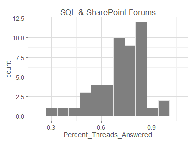  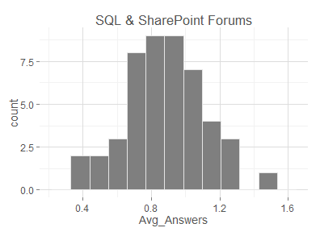   


The results look normal-ish, but the small sample size gives us only a rough picture. The vote-related graphs are skewed by some outliers, so let's remove the outliers and replot.

```r
forums.sub <- subset(forums, Avg_Votes_Per_View < 0.001)
gg2 <- ggplot(data = forums.sub) + labs(title = "SQL & SharePoint Forums") + my.theme
gg2 + geom_histogram(aes(x = Avg_Votes_Per_View), binwidth = 0.0001, fill = "grey50", colour = "grey90")

forums.sub <- subset(forums, Avg_Num_Votes < 0.75)
gg2 <- ggplot(data = forums.sub) + labs(title = "SQL & SharePoint Foums") + my.theme
gg2 + geom_histogram(aes(x = Avg_Num_Votes), binwidth = 0.05, fill = "grey50", colour = "grey90")

rm(forums.sub, gg2)
```

  


What happens if we break these each into two graph -- once for each forum category? How do the two forums compare?


```r
# create ggplot2 objects for each category
forums.sp <- subset(forums, Forum_Category == "SharePoint")
ggsp <- ggplot(data = forums.sp) + my.theme + labs(y="Number of Forums", title = "SharePoint Forums")
forums.sql <- subset(forums, Forum_Category == "SQL Server")
ggsql <- ggplot(data = forums.sql) + my.theme + labs(y="Number of Forums", title = "SQL Forums")

# for each success metric
for (ind in 4:8){
  # plot a histogram for SQL server
  print(ggsql + geom_histogram(aes_string(x = colnames(forums)[ind]),
    binwidth = diff(range(forums.sql[,ind]))/nbins, fill = "grey50", colour = "grey90"))
  # plot a histogram for SharePoint server
  print(ggsp + geom_histogram(aes_string(x = colnames(forums)[ind]),
    binwidth = diff(range(forums.sp[,ind]))/nbins, fill = "grey50", colour = "grey90"))
}
rm(ggsp, ggsql, nbins)
```

  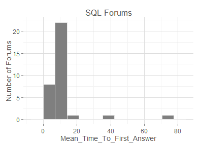 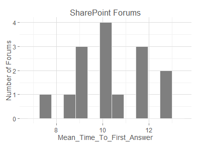 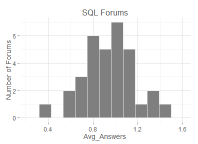 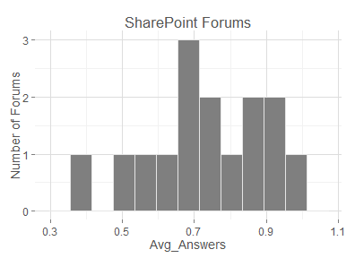    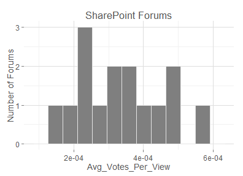 


### Correlation

Next, let's calculate the correlations between each of the metrics. Let's look at these for all 48 forums, plus for the SQL Server and SharePoint forums separately to see if we get more clear results.


```r
# load reshape so we can "melt"
library(reshape)

# create some stuff that I can reuse between plots
fill.grad <- scale_fill_gradient2(low="red", mid="white", high="green", midpoint=0, 
  space="rgb", guide="colourbar")
axis.theme <- theme(axis.text.y = element_text(size=10), 
  axis.text.x = element_text(size=10, angle=90))

# across all forums
cor.all <- cor(forums[,4:22])
ggplot(melt(cor.all), aes(X1, X2, fill=value)) + geom_tile() + my.theme + 
  fill.grad + axis.theme + labs(y="", x="", title = "All Forums")  

# limit to SharePoint forums
cor.sp <- cor(forums.sp[,4:22])
ggplot(melt(cor.sp), aes(X1, X2, fill=value)) + geom_tile() + my.theme +  
  fill.grad + axis.theme + labs(y="", x="", title = "SharePoint Forums")

# limit to SQL Server forums
cor.sql <- cor(forums.sql[,4:22])
ggplot(melt(cor.sql), aes(X1, X2, fill=value)) + geom_tile() + my.theme +
  fill.grad + axis.theme + labs(y="", x="", title = "SQL Forums")

rm(fill_grad, cor.all, cor.sql, cor.sp)
```

 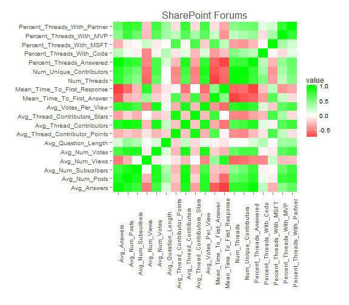  


That was a bad idea. Not very helpful, and most of the things that jump out are intuitively obvious. Perhaps some scatter plots (primarily with a success metric on the y-axis) and the data points color-coded by forum category will help.


```r
# scatter plot of percent threads answered vs. average number of answers per thread
ggplot(forums, aes(y=Percent_Threads_Answered, x=Avg_Answers)) +
  geom_point(aes(color=Forum_Category)) + my.colors + my.theme

# scatter plot of percent threads answered vs. average number of conributors per thread
ggplot(forums, aes(y=Percent_Threads_Answered, x=Avg_Thread_Contributors)) +
  geom_point(aes(color=Forum_Category)) + my.colors + my.theme

# scatter plot of percent threads answered vs. average number of posts per thread
ggplot(forums, aes(y=Percent_Threads_Answered, x=Avg_Num_Posts)) +
  geom_point(aes(color=Forum_Category)) + my.colors + my.theme

# scatter plot of mean time to first answer vs. mean time to first response
ggplot(forums, aes(y=Mean_Time_To_First_Answer, x=Mean_Time_To_First_Response)) +
  geom_point(aes(color=Forum_Category)) + my.colors + my.theme +
  coord_cartesian(ylim=c(0,20), xlim=c(0,12)) # ignore a couple far outliers

# scatter plot of mean time to first answer vs. number of unique contributors
ggplot(forums, aes(y=Mean_Time_To_First_Answer, x=Num_Unique_Contributors)) +
  geom_point(aes(color=Forum_Category)) + my.colors + my.theme +
  coord_cartesian(ylim=c(0,20)) # ignore a couple far outliers

# scatter plot of average number of answers per thread vs. average number of thread contributors
ggplot(forums, aes(y=Avg_Answers, x=Avg_Thread_Contributors)) +
  geom_point(aes(color=Forum_Category)) + my.colors + my.theme

# scatter plot of mean time to first answer vs. percent thread with MSFT involvement
ggplot(forums, aes(y=Mean_Time_To_First_Answer, x=Percent_Threads_With_MSFT)) +
  geom_point(aes(color=Forum_Category)) + my.colors + my.theme +
  coord_cartesian(ylim=c(0,20), xlim=c(0,0.20)) # ignore a couple far outliers

# scatter plot of mean time to first answer vs. percent thread with MVP involvement
ggplot(forums, aes(y=Mean_Time_To_First_Answer, x=Percent_Threads_With_MVP)) +
  geom_point(aes(color=Forum_Category)) + my.colors + my.theme +
  coord_cartesian(ylim=c(0,20), xlim=c(0,0.80)) # ignore a couple far outliers

# scatter plot of average number of votes per thread vs. percent thread with MSFT involvement
ggplot(forums, aes(y=Avg_Num_Votes, x=Percent_Threads_With_MSFT)) +
  geom_point(aes(color=Forum_Category)) + my.colors + my.theme +
  coord_cartesian(ylim=c(0,0.75), xlim=c(0,0.30)) # ignore a couple far outliers

# scatter plot of average number of votes per thread vs. average number of views per thread
ggplot(forums, aes(y=Avg_Num_Votes, x=Avg_Num_Views)) +
  geom_point(aes(color=Forum_Category)) + my.colors + my.theme +
  coord_cartesian(ylim=c(0,0.75), xlim=c(500,1500)) # ignore a couple far outliers

# scatter plot of number of threads vs. mean time to first answer
ggplot(forums, aes(y=Mean_Time_To_First_Answer, x=Num_Threads)) +
  geom_point(aes(color=Forum_Category)) + my.colors + my.theme +
  coord_cartesian(ylim=c(0,20)) # ignore a couple far outliers

# scatter plot of number of threads vs. mean time to first answer
ggplot(forums, aes(y=Mean_Time_To_First_Response, x=Num_Threads)) +
  geom_point(aes(color=Forum_Category)) + my.colors + my.theme +
  coord_cartesian(ylim=c(0,15)) # ignore a couple far outliers

# scatter plot of number of threads vs. mean time to first answer
ggplot(forums, aes(y=Mean_Time_To_First_Response, x=Avg_Question_Length)) +
  geom_point(aes(color=Forum_Category)) + my.colors + my.theme +
  coord_cartesian(ylim=c(0,15)) # ignore a couple far outliers

# scatter plot of number of threads vs. mean time to first answer
ggplot(forums, aes(y=Avg_Answers, x=Num_Threads)) +
  geom_point(aes(color=Forum_Category)) + my.colors + my.theme

rm(forums, forums.sp, forums.sql)
```

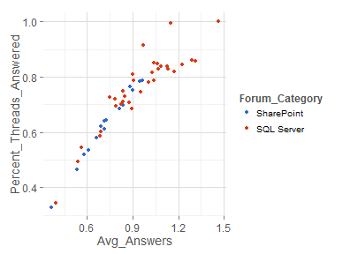    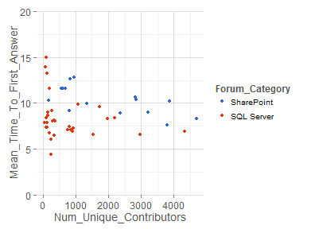  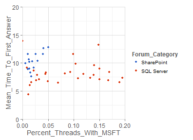 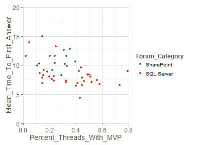  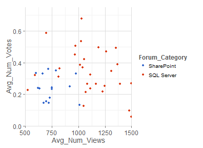 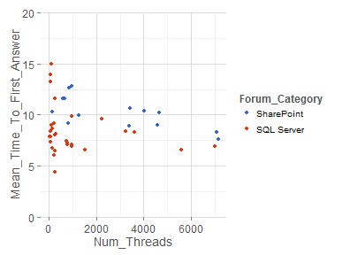 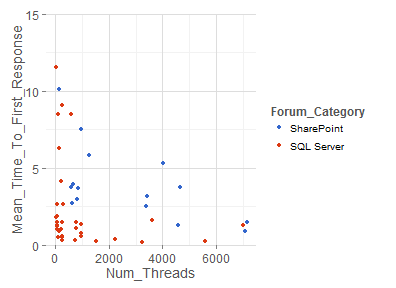 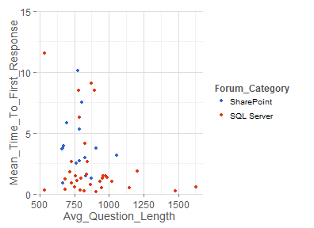 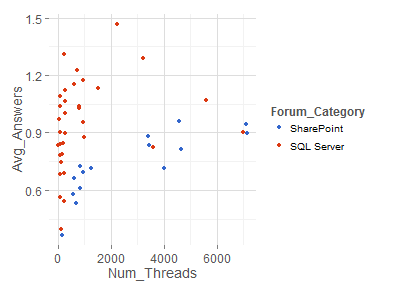 


My observations from looking at the above scatter plots follow. These do not reflect causation, only apparent patterns of correlation:

* Approximately 2.5 contributors per thread seems to be an activity-level turning point, below which 75% or less of the questions posted will be answered, and above which 75% or more of the questions posted will be answered.
* When it comes to answerings a higher percentage of questions posted, SQL tend to do better than SharePoint forums.
* More posts per thread generally translates into more threads being answered. No surprise here.
* Average first response times for the majority of SQL Server forums is are below 1.5 days. On the flip side, the majority of SharePoint forums have an average initial response time of over 3 days.
* Even when we compare SharePoint and SQL forums of relatively the same size (in terms of the number of unique contributors during 2013), SharePoint forums are on average slower in providing an answer than are SQL forums. Maybe product complexity is a factor here?
* SQL Server forums benefit from a higher rate of Microsoft involvement than does ShaerPoint.
* Forums with MVPs contributing to over 40% of the threads have relatively quick average times to first answer.
* Based on average thread views, SQL forums tend to get more traffic than SharePoint forums.
* Based on number of threads created, seven of the top-ten largest forums are SharePoint forums.

Looking at Threads
---------------------------
Now that we got a high-level look at the forum level, I want to drill down a little deeper and look at thread-level data. 

I'll start by loading the data from my database.


```r
# query the database and put results in a dataframe
threads <- sqlQuery(myDB, "SELECT * FROM Forums.dbo.Thread_Summary",
  stringsAsFactors=FALSE) 
# we can close the odbc connection now
odbcClose(myDB) 
rm(myDB)

# make sure data is loaded as expected
# we should have 72,324 threads
nrow(threads)
```

```
## [1] 72324
```

```r
# let's see the column names
colnames(threads)
```

```
##  [1] "Thread_ID"                "Title"                    "Question"                
##  [4] "Answered"                 "Num_Contributors"         "Asker_Type"              
##  [7] "Created_On"               "Answered_On"              "Answer_Has_Code"         
## [10] "Question_Has_Code"        "Forum_ID"                 "Forum_Name"              
## [13] "Forum_Category"           "Num_Answers"              "Time_To_First_Answer"    
## [16] "Num_Votes"                "Num_Votes_Per_View"       "Title_Length"            
## [19] "Question_Length"          "Num_Subscribers"          "Num_Views"               
## [22] "Time_To_First_Reply"      "Num_Posts"                "Num_Code_Posts"          
## [25] "Percent_Code_Posts"       "Num_MSFT_Contributors"    "Num_MSFT_Posts"          
## [28] "Num_MSFT_Answers"         "Num_MSFT_Code_Posts"      "Num_MSFT_Votes"          
## [31] "Num_MVP_Contributors"     "Num_MVP_Posts"            "Num_MVP_Answers"         
## [34] "Num_MVP_Code_Posts"       "Num_MVP_Votes"            "Num_Partner_Contributors"
## [37] "Num_Partner_Posts"        "Num_Partner_Answers"      "Num_Partner_Code_Posts"  
## [40] "Num_Partner_Votes"        "Avg_Contributor_Points"   "Avg_Contributor_Stars"   
## [43] "Created_Month"            "Created_Week_Day"         "Created_Hour"            
## [46] "Asker_Stars"              "Asker_Points"
```


The first 13 columns are identifiers and data types that will not work well doing math (i.e. string, dates, and booleans). Columns 14-17 are our success metrics. The remaining columns are attributes which might give us some interesting insight into what drives the success metrics.

I will append a few columns to *threads* with engineered features that will make my life a little easier later on.


```r
# group title lengths into groups, with one group per 10 characters of length
threads$Title_Length_Group <- floor(threads$Title_Length/10) * 10 + 5

# group question lengths into groups, with one group per 40 characters of length
threads$Question_Length_Group <- floor(threads$Question_Length/40) * 40 + 20

# round time to first reply to the nearest day
threads$TTFR_Group <- floor(threads$Time_To_First_Reply + 0.5)

# group asker points into groups, with one group per 100 points
threads$Asker_Points_Group <- floor(threads$Asker_Points/100) * 100 + 50
```


### Success Factor Distributions

Let's see how the success metrics are distributed at the thread level.


```r
# create ggplot2 object
ggt <- ggplot(data = threads) + labs(title = "SQL & SharePoint Threads") + my.theme

# Num_Answers histogram
ggt + geom_bar(aes(x = as.factor(Num_Answers)), binwidth=1, fill = "grey50", colour = "grey90") +
  coord_cartesian(xlim=c(0,8)) + labs(x="Number of Answers")

# Time_To_First_Answer histogram
ggt + geom_density(aes(x = Time_To_First_Answer), na.rm = TRUE, fill = "grey50", colour = "grey90") + 
  coord_cartesian(xlim=c(0,30)) + labs(x="Time to First Answer (days)")

# Num_Votes histogram
ggt + geom_bar(aes(x = as.factor(Num_Votes)), binwidth=1, fill = "grey50", colour = "grey90") +
  coord_cartesian(xlim=c(0,10)) + labs(x="Number of Votes")

# Num_Votes_Per_View histogram
ggt + geom_density(aes(x = Num_Votes_Per_View), na.rm = TRUE, fill = "grey50", colour = "grey90") +
  coord_cartesian(xlim=c(0,0.005)) +labs(x="Number of Votes per View")
```

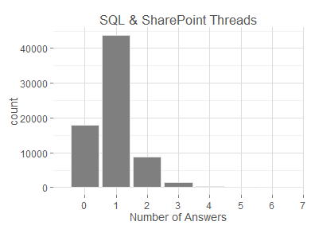  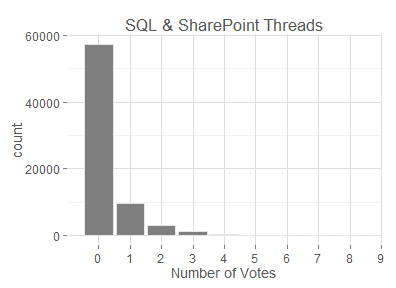 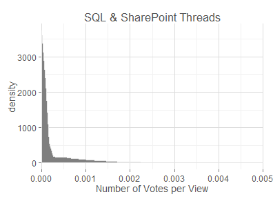 


That's an interesting double-peak in Time_To_First_Answer. Is that because we're mixing SQL and SharePoint? Let's take a look both forum categories side-by-side.


```r
# create ggplot2 objects
ggt.sql <- ggplot(data = subset(threads, Forum_Category == "SQL Server")) + 
  labs(title = "SQL Forums") + my.theme
ggt.sp <- ggplot(data = subset(threads, Forum_Category == "SharePoint")) + 
  labs(title = "SharePoint Forums") + my.theme

# Num_Answers histograms
ggt.sql + geom_bar(aes(x = as.factor(Num_Answers)), binwidth=1, fill = "grey50", colour = "grey90") + 
  coord_cartesian(xlim=c(0,8)) + labs(x="Number of Answers")
ggt.sp + geom_bar(aes(x = as.factor(Num_Answers)), binwidth=1, fill = "grey50", colour = "grey90") + 
  coord_cartesian(xlim=c(0,8)) + labs(x="Number of Answers")

# Time_To_First_Answer histogram
ggt.sql + geom_density(aes(x = Time_To_First_Answer), na.rm = TRUE, fill = "grey50", colour = "grey90") + 
  labs(x="Time to First Answer (days)") + coord_cartesian(xlim=c(0,30))
ggt.sp + geom_density(aes(x = Time_To_First_Answer), na.rm = TRUE, fill = "grey50", colour = "grey90") + 
  labs(x="Time to First Answer (days)") + coord_cartesian(xlim=c(0,30))

# Num_Votes histogram
ggt.sql + geom_bar(aes(x = as.factor(Num_Votes)), binwidth=1, fill = "grey50", colour = "grey90") + 
  labs(x="Number of Votes") + coord_cartesian(xlim=c(0,10))
ggt.sp + geom_bar(aes(x = as.factor(Num_Votes)), binwidth=1, fill = "grey50", colour = "grey90") + 
  labs(x="Number of Votes") + coord_cartesian(xlim=c(0,10))

# Num_Votes_Per_View histogram
ggt.sql + geom_density(aes(x = Num_Votes_Per_View), na.rm = TRUE, fill = "grey50", colour = "grey90") + 
  labs(x="Number of Votes per View") + coord_cartesian(xlim=c(0,0.005))
ggt.sp + geom_density(aes(x = Num_Votes_Per_View), na.rm = TRUE, fill = "grey50", colour = "grey90") + 
  labs(x="Number of Votes per View") + coord_cartesian(xlim=c(0,0.005))
```

   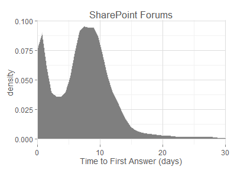 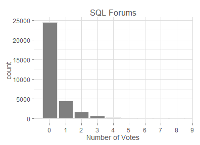    


That doesn't answer the double-peak question, but I do have a couple quick observations:
* Noticably more questions go unanswered in SharePoint forums as compared to SQL forums.
* Both forums seems to have the highest Time_To_First_Answer frequency at about 7 days and the second highest frequency at about 1 day.

If the double-peak isn't caused by the different types of forums, could it be influenced by where the weekend falls? Let's look at the days of the week individually and see if it becomes any clearer.


```r
for (day in 1:7)
{
  print(ggplot(data = subset(threads, Created_Week_Day == day)) + labs(title = paste("Day ", as.character(day)), x="Time to First Answer (days)") + 
  geom_density(aes(x = Time_To_First_Answer), na.rm = TRUE, fill = "grey50", colour = "grey90") + coord_cartesian(xlim=c(0,6)) + my.theme)
}
```

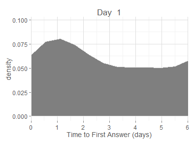  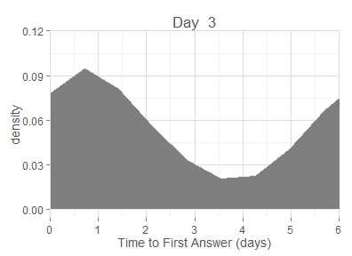 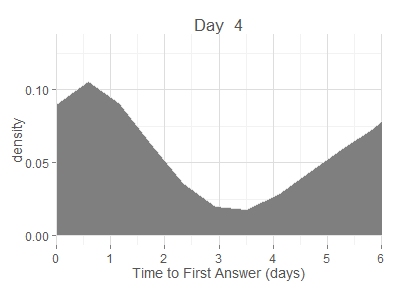  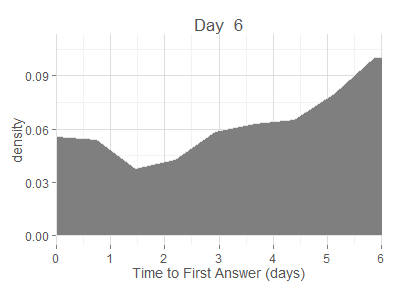  


Ah, yes. That's it. The days with the highest volume (Monday through Thursday) all have a significant trough when the weekend comes around (somewhere between 2 and 5 days), leading to a trough in the overall graph in that 2-5 day range.

### Other Distributions

Out of curiousity, I'd also like to see the distribution of the question/title length attributes and the time of the post attributes. These are things that are known immediately when a thread is posted, so they could be good inputs for a prediction model.


```r
# Title_Length density plot
ggt + geom_density(aes(x = Title_Length), fill = "grey50", colour = "grey90") + coord_cartesian(xlim=c(0,250)) +
  labs(x="Title Length (in characters)")

# Question_Length density plot
ggt + geom_density(aes(x = Question_Length), fill = "grey50", colour = "grey90") + coord_cartesian(xlim=c(0,5000)) +
  labs(x="Question Length (in characters)")

# Created_Week_Day bar chart
ggt + geom_bar(aes(x = as.factor(Created_Week_Day)), binwidth=1, fill = "grey50", colour = "grey90") +
  labs(x="Created Week Day (0 = Sunday)")

# Created_Month bar chart 
ggt + geom_bar(aes(x = as.factor(Created_Month)), binwidth=1, fill = "grey50", colour = "grey90") +
  labs(x="Created Month (1 = January)")

# Created_Hour bar chart
ggt + geom_bar(aes(x = as.factor(Created_Hour)), binwidth=1, fill = "grey50", colour = "grey90") +
  labs(x="Created Hour (0 = 12 AM GMT)")
```

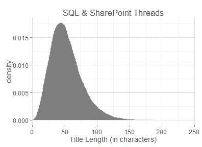 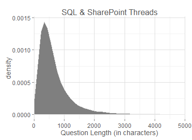  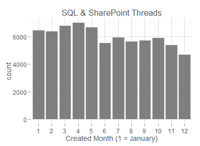 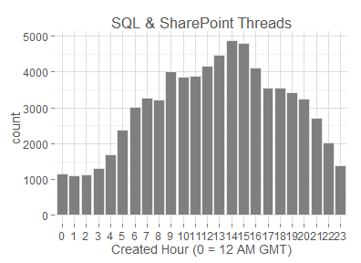 


And, let's see the distributions of threads based on the number of posts made by Microsft, MVPs, and partners.


```r
# MSFT histogram
ggt + geom_bar(aes(x = as.factor(Num_MSFT_Posts)), binwidth=1, fill = "grey50", colour = "grey90") +
  labs(x = "Number of Microsoft Posts")

# MSFT histogram without zero
ggt + geom_bar(aes(x = as.factor(Num_MSFT_Posts)), binwidth=1, fill = "grey50", colour = "grey90") + coord_cartesian(xlim=c(1.5,10), ylim=c(0,3000)) + labs(x = "Number of Microsoft Posts")

# MVP histogram
ggt + geom_bar(aes(x = as.factor(Num_MVP_Posts)), binwidth=1, fill = "grey50", colour = "grey90") + 
  coord_cartesian(xlim=c(0,11.5)) + labs(x = "Number of MVP Posts")

# MVP histogram without zero
ggt + geom_bar(aes(x = as.factor(Num_MVP_Posts)), binwidth=1, fill = "grey50", colour = "grey90") + 
  coord_cartesian(xlim=c(1.5,11.5), ylim=c(0,15000)) + labs(x = "Number of MVP Posts")

# Partner histogram
ggt + geom_bar(aes(x = as.factor(Num_Partner_Posts)), binwidth=1, fill = "grey50", colour = "grey90") + 
  coord_cartesian(xlim=c(0,11.5)) + labs(x = "Number of Partner Posts")

# Partner histogram without zero
ggt + geom_bar(aes(x = as.factor(Num_Partner_Posts)), binwidth=1, fill = "grey50", colour = "grey90") + 
  coord_cartesian(xlim=c(1.5,11.5), ylim=c(0,25000)) + labs(x = "Number of Partner Posts")
```

  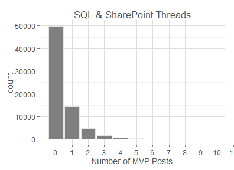 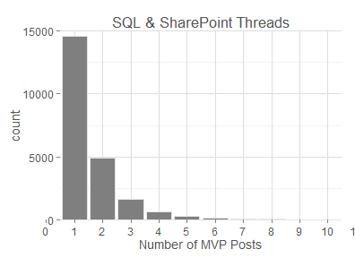 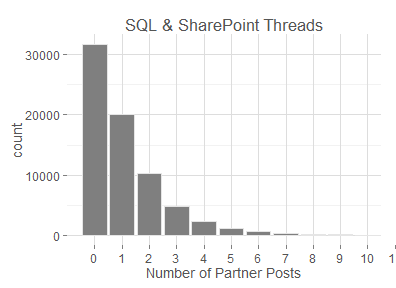 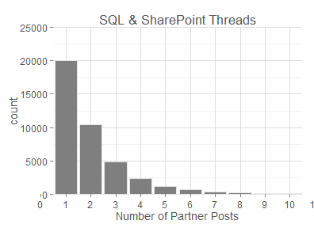 


Almost there... Here are the distributions of a few remaining, potentially interesting attributes.


```r
# asker points
ggt + geom_density(aes(x = Asker_Points), fill = "grey50", colour = "grey90") + 
  coord_cartesian(xlim=c(0,2000)) + labs(x="Asker Points (at time of scraping)")

# subscribers
ggt + geom_bar(aes(x = as.factor(Num_Subscribers)), binwidth=1, fill = "grey50", colour = "grey90") + 
  coord_cartesian(xlim=c(0,8.5)) + labs(x="Number of Subscribers")

# views
ggt + geom_density(aes(x = Num_Views), fill = "grey50", colour = "grey90") + coord_cartesian(xlim=c(0,4000)) + labs(x="Number of Views")

# TTFR
ggt + geom_density(aes(x = Time_To_First_Reply), na.rm = TRUE, fill = "grey50", colour = "grey90") + 
  coord_cartesian(xlim=c(0,10)) + labs(x="Time to First Reply (in days)")
```

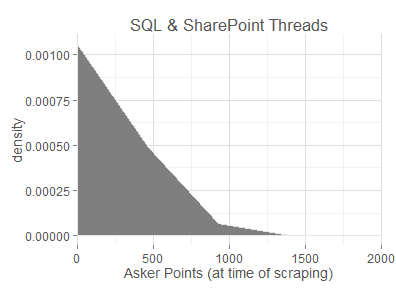  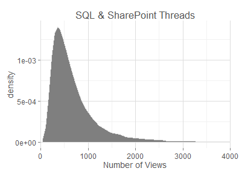  


### Microsoft Involvement

If I worked at Microsoft, I'd want to know how when employees are getting involved in threads and what impact it is having. So, I'm going to plot some distributions for those threads that Microsoft got involved in vs. those threads that Microsoft did not get involved in to see if there are any distinct differences.


```r

# create ggplot2 object for only MSFT-involved threads
ggt.msft <- ggplot(data = subset(threads, Num_MSFT_Posts > 0)) + 
  my.theme + labs(title = "Threads with MSFT Engagement")
ggt.not.msft <- ggplot(data = subset(threads, Num_MSFT_Posts == 0)) + 
  my.theme + labs(title = "Threads without MSFT Engagement")

# Num_Answers histogram
ggt.msft + geom_bar(aes(x = as.factor(Num_Answers)), binwidth=1, fill = "grey50", colour = "grey90") + 
  coord_cartesian(xlim=c(0,8)) + labs(x="Number of Answers")
ggt.not.msft + geom_bar(aes(x = as.factor(Num_Answers)), binwidth=1, fill = "grey50", colour = "grey90") + 
  coord_cartesian(xlim=c(0,8)) + labs(x="Number of Answers")

# Time_To_First_Answer histogram
ggt.msft + geom_density(aes(x = Time_To_First_Answer), na.rm = TRUE, fill = "grey50", colour = "grey90") + 
  coord_cartesian(xlim=c(0,30)) + labs(x="Time to First Answer (days)")
ggt.not.msft + geom_density(aes(x = Time_To_First_Answer), na.rm = TRUE, fill = "grey50", colour = "grey90") + 
  coord_cartesian(xlim=c(0,30)) + labs(x="Time to First Answer (days)")

# Num_Votes histogram
ggt.msft + geom_bar(aes(x = as.factor(Num_Votes)), binwidth=1, fill = "grey50", colour = "grey90") + 
  coord_cartesian(xlim=c(0,10)) + labs(x="Number of Votes")
ggt.not.msft + geom_bar(aes(x = as.factor(Num_Votes)), binwidth=1, fill = "grey50", colour = "grey90") + 
  coord_cartesian(xlim=c(0,10)) + labs(x="Number of Votes")

# Title_Length density plot
ggt.msft + geom_density(aes(x = Title_Length), fill = "grey50", colour = "grey90") + 
  coord_cartesian(xlim=c(0,250)) + labs(x="Title Length (in characters)")
ggt.not.msft + geom_density(aes(x = Title_Length), fill = "grey50", colour = "grey90") + 
  coord_cartesian(xlim=c(0,250)) + labs(x="Title Length (in characters)")

# Question_Length density plot
ggt.msft + geom_density(aes(x = Question_Length), fill = "grey50", colour = "grey90") + 
  coord_cartesian(xlim=c(0,5000)) + labs(x="Question Length (in characters)")
ggt.not.msft + geom_density(aes(x = Question_Length), fill = "grey50", colour = "grey90") + 
  coord_cartesian(xlim=c(0,5000)) + labs(x="Question Length (in characters)")

# Created_Week_Day bar chart
ggt.msft + geom_bar(aes(x = as.factor(Created_Week_Day)), binwidth=1, fill = "grey50", colour = "grey90") + labs(x="Created Week Day (0 = Sunday)")
ggt.not.msft + geom_bar(aes(x = as.factor(Created_Week_Day)), binwidth=1, fill = "grey50", colour = "grey90") + labs(x="Created Week Day (0 = Sunday)")

# Created_Month bar chart 
ggt.msft + geom_bar(aes(x = as.factor(Created_Month)), binwidth=1, fill = "grey50", colour = "grey90") + labs(x="Created Month (1 = January)")
ggt.not.msft + geom_bar(aes(x = as.factor(Created_Month)), binwidth=1, fill = "grey50", colour = "grey90") + labs(x="Created Month (1 = January)")

# Created_Hour bar chart
ggt.msft + geom_bar(aes(x = as.factor(Created_Hour)), binwidth=1, fill = "grey50", colour = "grey90") + labs(x="Created Hour (0 = 12 AM GMT)")
ggt.not.msft + geom_bar(aes(x = as.factor(Created_Hour)), binwidth=1, fill = "grey50", colour = "grey90") + labs(x="Created Hour (0 = 12 AM GMT)")

# Num_Votes_Per_View histogram
ggt.msft + geom_density(aes(x = Num_Votes_Per_View), na.rm = TRUE, fill = "grey50", colour = "grey90") + 
  coord_cartesian(xlim=c(0,0.005)) + labs(x="Number of Votes per View")
ggt.not.msft + geom_density(aes(x = Num_Votes_Per_View), na.rm = TRUE, fill = "grey50", colour = "grey90") + 
  coord_cartesian(xlim=c(0,0.005)) + labs(x="Number of Votes per View")

# asker points
ggt.msft + geom_density(aes(x = Asker_Points), fill = "grey50", colour = "grey90") + 
  coord_cartesian(xlim=c(0,2000)) + labs(x="Asker Points (at time of scraping)")
ggt.not.msft + geom_density(aes(x = Asker_Points), fill = "grey50", colour = "grey90") + 
  coord_cartesian(xlim=c(0,2000)) + labs(x="Asker Points (at time of scraping)")

# subscribers
ggt.msft + geom_bar(aes(x = as.factor(Num_Subscribers)), binwidth=1, fill = "grey50", colour = "grey90") + 
  coord_cartesian(xlim=c(0,8.5)) + labs(x="Number of Subscribers")
ggt.not.msft + geom_bar(aes(x = as.factor(Num_Subscribers)), binwidth=1, fill = "grey50", colour = "grey90") + 
  coord_cartesian(xlim=c(0,8.5)) + labs(x="Number of Subscribers")

# views
ggt.msft + geom_density(aes(x = Num_Views), fill = "grey50", colour = "grey90") + 
  coord_cartesian(xlim=c(0,4000)) + labs(x="Number of Views")
ggt.not.msft + geom_density(aes(x = Num_Views), fill = "grey50", colour = "grey90") + 
  coord_cartesian(xlim=c(0,4000)) + labs(x="Number of Views")

# TTFR
ggt.msft + geom_density(aes(x = Time_To_First_Reply), na.rm = TRUE, fill = "grey50", colour = "grey90") + 
  coord_cartesian(xlim=c(0,10)) + labs(x="Time to First Reply (days)")
ggt.not.msft + geom_density(aes(x = Time_To_First_Reply), na.rm = TRUE, fill = "grey50", colour = "grey90") + 
  coord_cartesian(xlim=c(0,10)) + labs(x="Time to First Reply (days)")

rm(ggt.msft, ggt.not.msft)
```

 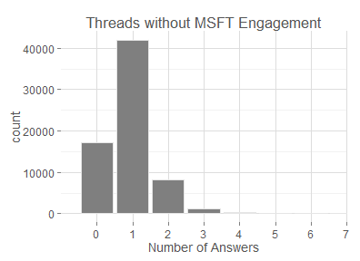 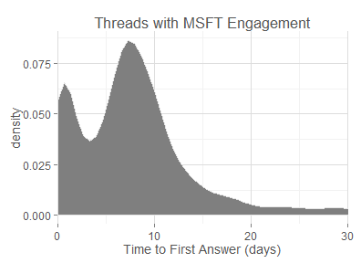   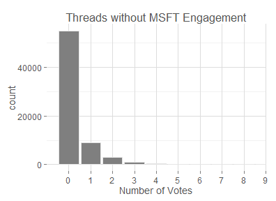 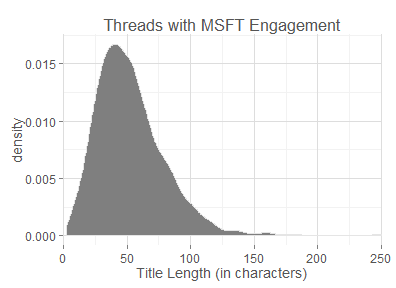   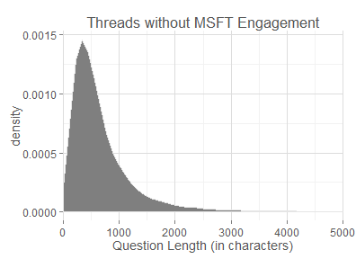   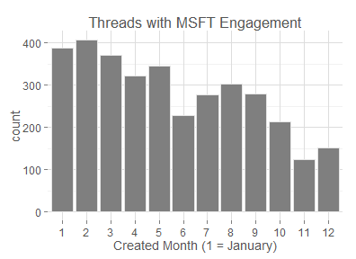       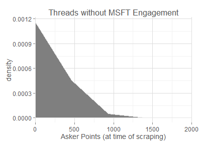       


The most obvious differences between Microsoft-involved threads and the rest of the population:

* Microsoft involvement is skewed toward threads started by users with very few reputation points.
* Threads where Microsoft is involved tend to have more views and more subscribers than other threads.
* Microsoft is involved in a disproportionately few threads that are answered in the first one or two days.

### Correlations


```r
# across all threads
cor.all <- cor(threads[,14:47], use="pairwise.complete.obs")
ggplot(melt(cor.all), aes(X1, X2, fill=value)) + geom_tile() + my.theme + 
  fill.grad + axis.theme + labs(y="", x="", title = "All Threads")  

rm(cor.all, axis.theme)
```

 


This is useless. On to something else...

### Responsiveness

Is there some relationship between the length of the title/question and time to first reply/first answer?


```r
# scatter plot of TTFR vs. the title's length

ggt + aes(y=Time_To_First_Reply, x=Title_Length_Group) +
  coord_cartesian(xlim=c(0,125), ylim=c(0,4)) +
  stat_summary(fun.y = 'mean', fun.ymin = mean, fun.ymax = mean)

# scatter plot of TTFA vs. the title's length
ggt + aes(y=Time_To_First_Answer, x=Title_Length_Group) +
  coord_cartesian(xlim=c(0,125), ylim=c(0,15)) +
  stat_summary(fun.y = 'mean', fun.ymin = mean, fun.ymax = mean)

# scatter plot of TTFR vs. the question's length
ggt + aes(y=Time_To_First_Reply, x=Question_Length_Group) +
  coord_cartesian(xlim=c(0,2000), ylim=c(0,4)) +
  stat_summary(fun.y = 'mean', fun.ymin = mean, fun.ymax = mean)

# scatter plot of TTFA vs. the question's length
ggt + aes(y=Time_To_First_Answer, x=Question_Length_Group) +
  coord_cartesian(xlim=c(0,2000), ylim=c(0,15)) +
  stat_summary(fun.y = 'mean', fun.ymin = mean, fun.ymax = mean)
```

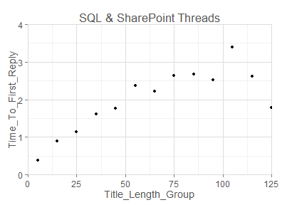    


It appears that shorter titles and short questions lead to faster first replies and first answers. This could be that shorter questions are easier/simpler questions. Or, perhaps longer questions could discourage people from reading them.

Does the time the post was made affect the speed at which it is replied to and answered?


```r

# scatter plot of TTFR vs. the hour
ggt + aes(y=Time_To_First_Reply, x=as.factor(Created_Hour)) +
  coord_cartesian(xlim=c(0,25), ylim=c(0,3)) +
  stat_summary(fun.y = 'mean', fun.ymin = mean, fun.ymax = mean)

# scatter plot of TTFA vs. the hour
ggt + aes(y=Time_To_First_Answer, x=as.factor(Created_Hour)) +
  coord_cartesian(xlim=c(0,25), ylim=c(0,15)) +
  stat_summary(fun.y = 'mean', fun.ymin = mean, fun.ymax = mean)

# scatter plot of TTFR vs. the day
ggt + aes(y=Time_To_First_Reply, x=as.factor(Created_Week_Day)) +
  coord_cartesian(xlim=c(0,8), ylim=c(0,3)) +
  stat_summary(fun.y = 'mean', fun.ymin = mean, fun.ymax = mean)

# scatter plot of TTFA vs. the day
ggt + aes(y=Time_To_First_Answer, x=as.factor(Created_Week_Day)) +
  coord_cartesian(xlim=c(0,8), ylim=c(0,15)) +
  stat_summary(fun.y = 'mean', fun.ymin = mean, fun.ymax = mean)

# scatter plot of TTFR vs. the month
ggt + aes(y=Time_To_First_Reply, x=as.factor(Created_Month)) +
  coord_cartesian(xlim=c(0,13), ylim=c(0,3)) +
  stat_summary(fun.y = 'mean', fun.ymin = mean, fun.ymax = mean)

# scatter plot of TTFA vs. the month
ggt + aes(y=Time_To_First_Answer, x=as.factor(Created_Month)) +
  coord_cartesian(xlim=c(0,13), ylim=c(0,15)) +
  stat_summary(fun.y = 'mean', fun.ymin = mean, fun.ymax = mean)
```

   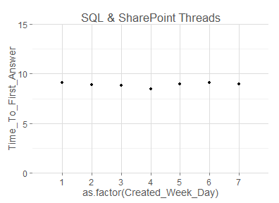  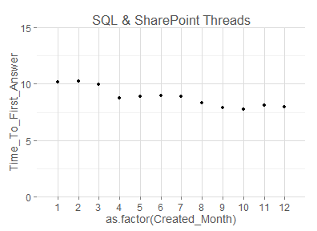 


While a question posted on a weekend will get a faster initial reply, there isn't any evidence of the question actually being resolved any faster than any other day of the week.

Posting a question later in the year did, however, seem to yield both faster initial responses and answers. We saw earlier that the total number of questions asked decreased as the year progressed, so perhaps this trend shows that fewer questions posted allow the questions that are posted to gain more attention and be resolved more quickly. This hypothesis would also make sense with the observation that the weekends (with the lowest number of new issues) give the fastest initial responses.

Is it possible that other factors played a role in the responsiveness improvement over the course of the year? For example, SharePoint 2013 went GA on 2/28/13. Maybe procedural changes lead to heaver involvment from experts as the year progressed. Let's take a look...


```r

# MSFTs

msft.ply <- ddply(threads, "Created_Month", summarise, Total_MSFT_Posts = sum(Num_MSFT_Posts), 
  Total_Posts = sum(Num_Posts))

gg.msft <- ggplot(msft.ply, aes(x = factor(Created_Month))) + my.theme +
  labs(title="SQL & SharePoint Threads", x="Created Month (January = 1)") + 
  geom_bar(stat = "identity", fill = "grey50", colour = "grey90")

gg.msft + aes(y = Total_MSFT_Posts) + labs(y="Number of MSFT Posts") 
gg.msft + aes(y = Total_MSFT_Posts/Total_Posts) + labs(y="MSFT Posts as Percent of Total Posts")

# MVPs

mvp.ply <- ddply(threads, "Created_Month", summarise, Total_MVP_Posts = sum(Num_MVP_Posts), 
  Total_Posts = sum(Num_Posts))

gg.mvp <- ggplot(mvp.ply, aes(x = factor(Created_Month))) + my.theme + 
  labs(title="SQL & SharePoint Threads", x="Created Month (January = 1)") + 
  geom_bar(stat = "identity", fill = "grey50", colour = "grey90")

gg.mvp + aes(y = Total_MVP_Posts) + labs(y="Number of MVP Posts")
gg.mvp + aes(y = Total_MVP_Posts/Total_Posts) + labs(y="MVP Posts as Percent of Total Posts")

# Partners

part.ply <- ddply(threads, "Created_Month", summarise, Total_Partner_Posts = sum(Num_Partner_Posts), 
  Total_Posts = sum(Num_Posts))

gg.part <- ggplot(part.ply, aes(x = factor(Created_Month))) + my.theme + 
  labs(title="SQL & SharePoint Threads", x="Created Month (January = 1)") + 
  geom_bar(stat = "identity", fill = "grey50", colour = "grey90")

gg.part + aes(y = Total_Partner_Posts) + labs(y="Number of Partner Posts")
gg.part + aes(y = Total_Partner_Posts/Total_Posts) + labs(y="Partner Posts as Percent of Total Posts")

rm(ggt, msft.ply, gg.msft, mvp.ply, gg.mvp, part.ply, gg.part)
```

  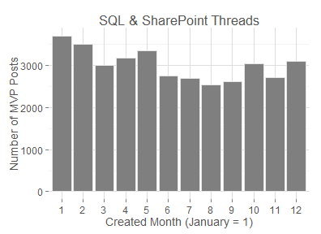  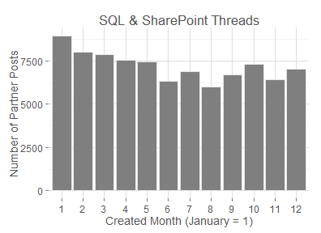  


It looks like MSFT employees took a break (just like everyone else) at the end of the year. There was an uptick in the relative level of MVP and partner activity, but I'm doubtful this made any significant difference. However, I did find it surprising to see the level of partner activity is greater than 25%. 

To look at the posibility of seasonality, we could scrape another year of data from the website, but I'll leave that for a follow up analysis...

### Success Rate

The ultimate question of a thread's success is really whether or not it ever got answered. Of course we'd like to see it happen as fast as possible, but the more important thing is to see whether it was resolved at all. Let's look at the "success rate" (the ratio of threads that received an answer to the total number of threads created) in a few different slices.


```r
# By month
succ.ply <- ddply(threads, "Created_Month", summarise, Total_Questions = length(Num_Answers), Successes = sum(Answered))
ggplot(succ.ply, aes(x = factor(Created_Month), y = Successes/Total_Questions)) + my.theme +
  labs(title="SQL & SharePoint Threads", x="Created Month (1 = January)", y="Success Rate") + geom_point()

# By week day
succ.ply <- ddply(threads, "Created_Week_Day", summarise, Total_Questions = length(Num_Answers), Successes = sum(Answered))
ggplot(succ.ply, aes(x = factor(Created_Week_Day), y = Successes/Total_Questions)) + my.theme + 
  labs(title="SQL & SharePoint Threads", x="Created Week Day (0 = Sunday)", y="Success Rate") + geom_point()

# By time of day
succ.ply <- ddply(threads, "Created_Hour", summarise, Total_Questions = length(Num_Answers), Successes = sum(Answered))
ggplot(succ.ply, aes(x = factor(Created_Hour), y = Successes/Total_Questions)) + my.theme + 
  labs(title="SQL & SharePoint Threads", x="Created Hour (0 = 12 AM GMT)", y="Success Rate") + geom_point()

# By title length
succ.ply <- ddply(threads, "Title_Length_Group", summarise, Total_Questions = length(Num_Answers), Successes = sum(Answered))
ggplot(succ.ply, aes(x = Title_Length_Group, y = Successes/Total_Questions)) + my.theme + 
  labs(title="SQL & SharePoint Threads", y="Success Rate", x="Title Length (in characters)") +
  geom_point() + coord_cartesian(xlim=c(0,130), ylim=c(0.5, 1))

# By question length
succ.ply <- ddply(threads, "Question_Length_Group", summarise, Total_Questions = length(Num_Answers), Successes = sum(Answered))
ggplot(succ.ply, aes(x = Question_Length_Group, y = Successes/Total_Questions)) + my.theme + 
  labs(title="SQL & SharePoint Threads", y="Success Rate", x="Question Length (in characters)") +
  geom_point() + coord_cartesian(xlim=c(0,2100), ylim=c(0.5, 1))

# By Asker Stars
succ.ply <- ddply(threads, "Asker_Stars", summarise, Total_Questions = length(Num_Answers), Successes = sum(Answered))
ggplot(succ.ply, aes(x = factor(Asker_Stars), y = Successes/Total_Questions)) + my.theme + 
  labs(title="SQL & SharePoint Threads", y="Success Rate", x="Asker Stars (at time of scraping)") + geom_point() + coord_cartesian( ylim=c(0.5, 1))

# By Asker Points
succ.ply <- ddply(threads, "Asker_Points_Group", summarise, Total_Questions = length(Num_Answers), Successes = sum(Answered))
ggplot(succ.ply, aes(x = Asker_Points_Group, y = Successes/Total_Questions)) + my.theme + 
  labs(title="SQL & SharePoint Threads", y="Success Rate", x="Asker Points (at time of scraping)") +
  geom_point() + coord_cartesian( ylim=c(0, 1), xlim=c(0,1000))

# By TTFR
succ.ply <- ddply(threads, "TTFR_Group", summarise, Total_Questions = length(Num_Answers), Successes = sum(Answered))
ggplot(succ.ply, aes(x = TTFR_Group, y = Successes/Total_Questions)) + my.theme + 
  labs(title="SQL & SharePoint Threads", y="Success Rate", x="Time To First Response (days)") +
  geom_point() + coord_cartesian(xlim=c(-0.5,20.5), ylim=c(0, 1))

# By MSFT posts
succ.ply <- ddply(threads, "Num_MSFT_Posts", summarise, Total_Questions = length(Num_Answers), Successes = sum(Answered))
ggplot(succ.ply, aes(x = factor(Num_MSFT_Posts), y = Successes/Total_Questions)) + my.theme + 
  labs(title="SQL & SharePoint Threads", y="Success Rate", x="Number of Microsoft Posts") +
  geom_point() + coord_cartesian(xlim=c(0.5,5.5), ylim=c(0, 1))

# By Questions with Code
succ.ply <- ddply(threads, "Question_Has_Code", summarise, Total_Questions = length(Num_Answers), Successes = sum(Answered))
ggplot(succ.ply, aes(x = factor(Question_Has_Code), y = Successes/Total_Questions)) + my.theme + 
  labs(title="SQL & SharePoint Threads", y="Success Rate", x="Question Has Code (1 = Yes)") +
  geom_point() + coord_cartesian(xlim=c(0.5, 2.5), ylim=c(0, 1))

rm(succ.ply)
```

  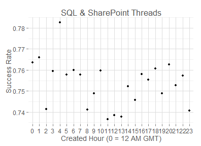   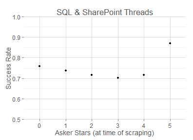     


These graphs reveal much the same as our earlier graphs. More success is seen for questions posted later in the year and on weekends. Shorter title and questions get better results than longer ones. Here is one last insightful morsel, though: If an issue gets an initial reply during the first five days, it is about 75% likely to eventually get resolved successfully. But, as each day after the 5-day mark passes, the question gets less and less likely to receive a successful answer. By day 10, the likelihood of a successful resolution is only about 50%. 

I am surprised to see that a question with code in the question are less likely to be answered. It was my intuition that questions that have code would be more likely to be answered because they are more reproducable and less likely to be overly vague. Perhaps the truth is that problems involving code are more likely to be complex and therefore are less likely to be answered.

### Modeling Success

Now that the high-level patterns in the data have been explored, I want to use some of that insight to build a model to gaugue the probability a post will be successfully resolved. And, I want to make this predicition based only on the attributes that I know immediately when the question is first posted. Theoretically, something like this could be used to identify weak posts and either (1) give feedback/suggestions to the poster or (2) alert Microsoft to give attention to these questions early.

To start, I will use a regression tree, as the results of this model should be interpretable and may provide further insight into drivers of thread success.

I will start by preparing the data, making all relavant into categorical data.


```r
# create new data.frame that will just have the columns desired for the tree model
tree.threads <- data.frame(Thread_ID = threads$Thread_ID)

# add the 'label' column, indicating success or failure
tree.threads$Success <- ceiling(threads$Num_Answers/100)

# add a TTFA column as another potential label
tree.threads$Time_To_First_Answer <- threads$Time_To_First_Answer

# add columns for date/time data
tree.threads$Created_Month <- factor(threads$Created_Month)
tree.threads$Created_Week_Day <- factor(threads$Created_Week_Day)
tree.threads$Created_Hour <- factor(threads$Created_Hour)

# add columns for question and title lengths
tree.threads$Question_Length <- floor(threads$Question_Length/200)
tree.threads$Question_Length <- factor(sapply(tree.threads$Question_Length, function(x) min(x, 5)))
tree.threads$Title_Length <- floor(threads$Title_Length/25)
tree.threads$Title_Length <- factor(sapply(tree.threads$Title_Length, function(x) min(x, 5)))

# add forum attributes
tree.threads$Forum_Category <- factor(threads$Forum_Category)
tree.threads$Forum_Name <- factor(threads$Forum_Name)

# add asker attributes
tree.threads$Asker_Stars <- factor(threads$Asker_Stars)
tree.threads$Asker_Type <- factor(threads$Asker_Type)
tree.threads$Asker_Points <- floor((threads$Asker_Points + 199)/200)
tree.threads$Asker_Points <- factor(sapply(tree.threads$Asker_Points, function(x) min(x, 6)))

# add whehter or not the question contained code
tree.threads$Question_Has_Code <- factor(threads$Question_Has_Code)
```


To break the data into training and test sets, I will exploit the fact that each thread has an ID that is a randomly generated GUID.


```r
# the training set has IDs beginning with a number
tree.threads.train <- subset(tree.threads, !is.na(as.numeric(substr(Thread_ID,1,1))))
nrow(tree.threads.train)
```

```
## [1] 45210
```

```r

# the test set has IDs beginning with a letter d or later
tree.threads.test <- subset(tree.threads, is.na(as.numeric(substr(Thread_ID,1,1))))
nrow(tree.threads.test)
```

```
## [1] 27114
```


Ok. Now it's time to train the model. I will use the *party* package to fit a regression tree.


```r
library(party)

# fit the tree
success.tree <- ctree(formula = Success ~ Created_Month + Created_Week_Day + Created_Hour + Question_Length + Title_Length + Forum_Category + Forum_Name + Asker_Stars + Asker_Type + Asker_Points, data = tree.threads.train)

# use the model to calculate success probabilities for each test example
tree.threads.test$prediction <- Predict(success.tree, tree.threads.test)

# group predictions into 4% ranges
tree.threads.test$prediction_range <- ceiling(tree.threads.test$prediction * 25.0) / 25.0 - 0.02

# aggregate by the 5% ranges to see how the predictions compared to the results
succ.ply <- ddply(tree.threads.test, "prediction_range", summarise, Total_Questions = length(Success), Successes = sum(Success))
succ.ply
```

```
##    prediction_range Total_Questions Successes
## 1              0.18              32        10
## 2              0.38             368       172
## 3              0.50            1323       689
## 4              0.54             714       370
## 5              0.58             842       530
## 6              0.62            1613      1009
## 7              0.66            2718      1836
## 8              0.70             434       295
## 9              0.74            6105      4569
## 10             0.78            3211      2537
## 11             0.82            5356      4429
## 12             0.86             705       578
## 13             0.90            2380      2115
## 14             0.94             305       283
## 15             0.98            1008      1005
```

```r

# plot the performance of the model on the test data
ggplot(succ.ply, aes(x = as.numeric(prediction_range), y = Successes/Total_Questions)) + my.theme + 
  labs(title="SQL & SharePoint Threads", y="Actual Success Rate", x="Predicted Success Rate") + geom_point() + 
  coord_cartesian(xlim=c(0.15, 1), ylim=c(0.15, 1))
```

 


Not too bad. This model gives us reasonable indicators of how likely a question is to be answered. Let's dig into the model to see if we can gain an intuitive understanding of how it is making these predictions. I'll spare you the graphic here, but there are 41 terminal nodes, with up to six decision points before we come to a conclusion. The predictors used in the model and the number of times they are used:

* 11 Question_Length
* 9 Forum_Name
* 7 Created_Month
* 6 Title_Length
* 5 Forum_Category
* 1 Asker_Stars
* 1 Asker_Points

So it seem that the key factors influencing success are the length of the title/question, the forum to which it was posted, and the time of year. Notably weak or missing predictors are the time of day, day of week, and credentials of the asker.

While it will surely have a negative impact on the granularity provided by the model, let's remove Forum_Name and see if that shrinks the tree to a more interpretable level.


```r
# fit the tree
success.tree <- ctree(formula = Success ~ Created_Month + Created_Week_Day + Created_Hour + Question_Length + Title_Length + Forum_Category + Asker_Stars + Asker_Type + Asker_Points + Question_Has_Code, data = tree.threads.train)

# use the model to calculate success probabilities for each test example
tree.threads.test$prediction <- Predict(success.tree, tree.threads.test)

# group predictions into 4% ranges
tree.threads.test$prediction_range <- ceiling(tree.threads.test$prediction * 25.0) / 25.0 - 0.02

# aggregate by the 5% ranges to see how the predictions compared to the results
succ.ply <- ddply(tree.threads.test, "prediction_range", summarise, Total_Questions = length(Success), Successes = sum(Success))
succ.ply
```

```
##    prediction_range Total_Questions Successes
## 1              0.54             351       202
## 2              0.62            1921      1158
## 3              0.66            4090      2726
## 4              0.70            3508      2523
## 5              0.74            4521      3336
## 6              0.78            3187      2467
## 7              0.82            6317      5148
## 8              0.86            1966      1734
## 9              0.90             364       328
## 10             0.94             889       805
```

```r

# plot the performance of the model on the test data
ggplot(succ.ply, aes(x = as.numeric(prediction_range), y = Successes/Total_Questions))+ my.theme + 
  labs(title="SQL & SharePoint Threads", y="Actual Success Rate", x="Predicted Success Rate") + 
  geom_point() + coord_cartesian(xlim=c(0.15, 1), ylim=c(0.15, 1))
```

 


This tree is a little more readable, so let's take a look.


```r
# view the tree
plot(success.tree)

rm(success.tree, succ.ply, tree.threads, tree.threads.train, tree.threads.test)
```

 


The results here confirm our obserations from the more complex tree. We see that the first two splits are based on Question_Length and Forum_Category. Question_Length continues to play a role in many further splits and Created_Month figures prominently.

With fewer terminal nodes, the simpler model gives us fewer predictions with low probabilities. In fact, it has no predictions with a probability as low as 50%. The more complicated model had over 1,700 predictions in the test set with 50% probability or less. This appears to be evidence of under-fitting.

Unfortuantely, even the more complex tree does not yield a high percentage of points with less that 50% probability. So, while we are able to look at questions with less than 70% success probablity and know these are more likely to not get answered than questions with 90% success probability, there is still a lot of room left for providing further granularity. This isn't surprising considering the small number of predictors we are considering. Text analysis will probably be needed to significantly improve the performance of this model.

Next, let's try another less interpretable model -- a logit regression.


```r
# create new data.frame that will just have the columns desired for the logit model
logit.threads <- data.frame(Thread_ID = threads$Thread_ID)

# add the 'label' column, indicating success or failure
logit.threads$Success <- ceiling(threads$Num_Answers/100)

# add a TTFA column as another potential label
logit.threads$Time_To_First_Answer <- threads$Time_To_First_Answer

# add columns for date/time data
logit.threads$Created_Month <- factor(threads$Created_Month)
logit.threads$Created_Week_Day <- factor(threads$Created_Week_Day)
logit.threads$Created_Hour <- factor(threads$Created_Hour)

# add columns for question and title lengths
logit.threads$Question_Length <- threads$Question_Length
logit.threads$Title_Length <- threads$Title_Length

# add forum attributes
logit.threads$Forum_Category <- factor(threads$Forum_Category)
logit.threads$Forum_Name <- factor(threads$Forum_Name)

# add asker attributes
logit.threads$Asker_Stars <- threads$Asker_Stars
logit.threads$Asker_Type <- factor(threads$Asker_Type)
logit.threads$Asker_Points <- threads$Asker_Points

# add whehter or not the question contained code
logit.threads$Question_Has_Code <- factor(threads$Question_Has_Code)
```


Like, before I will break the data into test and training sets using the GUID.


```r
# the training set has IDs beginning with a number
logit.threads.train <- subset(logit.threads, !is.na(as.numeric(substr(Thread_ID,1,1))))
nrow(logit.threads.train)
```

```
## [1] 45210
```

```r

# the test set has IDs beginning with a letter d or later
logit.threads.test <- subset(logit.threads, is.na(as.numeric(substr(Thread_ID,1,1))))
nrow(logit.threads.test)
```

```
## [1] 27114
```


Now for the magic. Let's fit the model using the aod package.


```r
# make sure the package is loaded
library(aod)

# fit the logistic regression model
success.logit <- glm(Success ~ Created_Month + Created_Week_Day + Created_Hour + Question_Length + Title_Length + Forum_Category + Asker_Stars + Asker_Type + Asker_Points + Question_Has_Code, data = logit.threads.train, family = poisson())

# what does the model look like?
summary(success.logit)
```

```
## 
## Call:
## glm(formula = Success ~ Created_Month + Created_Week_Day + Created_Hour + 
##     Question_Length + Title_Length + Forum_Category + Asker_Stars + 
##     Asker_Type + Asker_Points + Question_Has_Code, family = poisson(), 
##     data = logit.threads.train)
## 
## Deviance Residuals: 
##     Min       1Q   Median       3Q      Max  
## -1.3938   0.0589   0.2277   0.3071   1.5615  
## 
## Coefficients:
##                           Estimate Std. Error z value Pr(>|z|)    
## (Intercept)              -2.40e-01   2.08e-01   -1.16   0.2474    
## Created_Month2           -3.29e-02   2.58e-02   -1.28   0.2022    
## Created_Month3           -1.51e-02   2.53e-02   -0.60   0.5515    
## Created_Month4           -3.25e-02   2.52e-02   -1.29   0.1967    
## Created_Month5           -6.77e-02   2.57e-02   -2.63   0.0086 ** 
## Created_Month6           -4.90e-02   2.70e-02   -1.82   0.0692 .  
## Created_Month7           -3.52e-02   2.64e-02   -1.33   0.1827    
## Created_Month8           -5.10e-03   2.64e-02   -0.19   0.8467    
## Created_Month9            4.29e-03   2.62e-02    0.16   0.8697    
## Created_Month10           2.49e-02   2.59e-02    0.97   0.3345    
## Created_Month11           3.01e-02   2.66e-02    1.13   0.2586    
## Created_Month12           6.13e-02   2.74e-02    2.24   0.0253 *  
## Created_Week_Day2        -4.01e-02   2.99e-02   -1.34   0.1795    
## Created_Week_Day3        -5.77e-02   2.95e-02   -1.95   0.0507 .  
## Created_Week_Day4        -4.39e-02   2.96e-02   -1.48   0.1376    
## Created_Week_Day5        -5.47e-02   2.96e-02   -1.85   0.0649 .  
## Created_Week_Day6        -3.86e-02   3.01e-02   -1.28   0.1993    
## Created_Week_Day7        -2.98e-03   3.74e-02   -0.08   0.9365    
## Created_Hour1             6.50e-03   6.15e-02    0.11   0.9158    
## Created_Hour2            -2.90e-02   6.11e-02   -0.47   0.6348    
## Created_Hour3            -2.76e-03   5.81e-02   -0.05   0.9621    
## Created_Hour4             3.57e-02   5.53e-02    0.65   0.5179    
## Created_Hour5            -4.31e-03   5.25e-02   -0.08   0.9345    
## Created_Hour6             1.04e-02   5.06e-02    0.21   0.8364    
## Created_Hour7            -1.49e-02   5.03e-02   -0.30   0.7663    
## Created_Hour8            -2.51e-02   5.04e-02   -0.50   0.6185    
## Created_Hour9            -8.47e-03   4.90e-02   -0.17   0.8629    
## Created_Hour10           -5.62e-03   4.91e-02   -0.11   0.9088    
## Created_Hour11           -2.88e-02   4.93e-02   -0.58   0.5591    
## Created_Hour12           -1.33e-02   4.88e-02   -0.27   0.7850    
## Created_Hour13           -1.55e-02   4.84e-02   -0.32   0.7494    
## Created_Hour14           -5.52e-03   4.78e-02   -0.12   0.9081    
## Created_Hour15           -6.74e-03   4.80e-02   -0.14   0.8882    
## Created_Hour16           -9.18e-03   4.89e-02   -0.19   0.8510    
## Created_Hour17            1.94e-03   4.95e-02    0.04   0.9687    
## Created_Hour18           -1.61e-03   4.96e-02   -0.03   0.9740    
## Created_Hour19            2.25e-03   4.97e-02    0.05   0.9639    
## Created_Hour20            2.03e-03   5.01e-02    0.04   0.9677    
## Created_Hour21           -2.39e-02   5.16e-02   -0.46   0.6426    
## Created_Hour22           -9.28e-03   5.40e-02   -0.17   0.8636    
## Created_Hour23           -2.34e-02   5.87e-02   -0.40   0.6898    
## Question_Length          -2.96e-05   4.69e-06   -6.31  2.7e-10 ***
## Title_Length             -1.34e-03   2.08e-04   -6.44  1.2e-10 ***
## Forum_CategorySQL Server  1.19e-01   1.10e-02   10.88  < 2e-16 ***
## Asker_Stars              -2.14e-02   1.11e-02   -1.92   0.0544 .  
## Asker_TypeMVP             2.07e-02   2.30e-01    0.09   0.9280    
## Asker_TypeOther           6.40e-02   2.00e-01    0.32   0.7496    
## Asker_Points              2.24e-06   1.80e-06    1.24   0.2142    
## Question_Has_Code1       -3.95e-02   2.32e-02   -1.70   0.0888 .  
## ---
## Signif. codes:  0 '***' 0.001 '**' 0.01 '*' 0.05 '.' 0.1 ' ' 1
## 
## (Dispersion parameter for poisson family taken to be 1)
## 
##     Null deviance: 19433  on 45209  degrees of freedom
## Residual deviance: 19134  on 45161  degrees of freedom
## AIC: 87154
## 
## Number of Fisher Scoring iterations: 5
```

```r

# use the model to calculate success probabilities for each test example
logit.threads.test$prediction <- Predict(success.logit, logit.threads.test, type="response")

# group predictions into 4% ranges
logit.threads.test$prediction_range <- ceiling(logit.threads.test$prediction * 25.0) / 25.0 - 0.02

# aggregate by the 5% ranges to see how the predictions compared to the results
succ.ply <- ddply(logit.threads.test, "prediction_range", summarise, Total_Questions = length(Success), Successes = sum(Success))
succ.ply
```

```
##    prediction_range Total_Questions Successes
## 1              0.14               1         1
## 2              0.18               1         1
## 3              0.22               3         2
## 4              0.26               3         2
## 5              0.30               4         2
## 6              0.34              10         7
## 7              0.38              13         9
## 8              0.42              14         5
## 9              0.46              19         8
## 10             0.50              27        18
## 11             0.54              78        42
## 12             0.58             163       100
## 13             0.62             645       379
## 14             0.66            2637      1676
## 15             0.70            6103      4266
## 16             0.74            5909      4438
## 17             0.78            4644      3714
## 18             0.82            3980      3289
## 19             0.86            2068      1768
## 20             0.90             663       583
## 21             0.94             113       102
## 22             0.98              16        15
```

```r

# plot the performance of the model on the test data
ggplot(succ.ply, aes(x = as.numeric(prediction_range), y = Successes/Total_Questions))+ my.theme + 
  labs(title="SQL & SharePoint Threads", y="Actual Success Rate", x="Predicted Success Rate") + 
  geom_point() + coord_cartesian(xlim=c(0.0, 1), ylim=c(0.0, 1))
```

 


Like the tree model, this seems to give us a reasonable probabilities for our test data. But, again, the model gives us very few predictions with probability < 50%. Could this be because we don't have enough failures in the training data?


```r
# do some fancy subsetting to get almost balanced training set
logit.threads.train <- subset(logit.threads, (is.na(as.numeric(substr(Thread_ID,1,1))) | substr(Thread_ID,1,1) < 'c') & (Success == 0 | is.na(as.numeric(substr(Thread_ID,1,1)))))
nrow(logit.threads.train)
```

```
## [1] 38363
```

```r

# make sure we are relatively balanced
nrow(subset(logit.threads.train, Success == 1))
```

```
## [1] 20427
```

```r
nrow(subset(logit.threads.train, Success == 0))
```

```
## [1] 17936
```

```r

# the test set is all the stuff not in the training set
logit.threads.test <- subset(logit.threads, is.na(as.numeric(substr(Thread_ID,1,1))) & substr(Thread_ID,1,1) >= 'c')
nrow(logit.threads.test)
```

```
## [1] 18167
```

```r

nrow(subset(logit.threads.test, Success == 1))
```

```
## [1] 13756
```

```r
nrow(subset(logit.threads.test, Success == 0))
```

```
## [1] 4411
```

```r

# fit the logistic regression model (again)
success.logit <- glm(Success ~ Created_Month + Created_Week_Day + Created_Hour + Question_Length + Title_Length + Forum_Category + Asker_Stars + Asker_Type + Asker_Points + Question_Has_Code, data = logit.threads.train, family = poisson())

# what does the model look like?
summary(success.logit)
```

```
## 
## Call:
## glm(formula = Success ~ Created_Month + Created_Week_Day + Created_Hour + 
##     Question_Length + Title_Length + Forum_Category + Asker_Stars + 
##     Asker_Type + Asker_Points + Question_Has_Code, family = poisson(), 
##     data = logit.threads.train)
## 
## Deviance Residuals: 
##    Min      1Q  Median      3Q     Max  
## -1.331  -0.996   0.337   0.569   2.617  
## 
## Coefficients:
##                           Estimate Std. Error z value Pr(>|z|)    
## (Intercept)              -5.74e-01   2.87e-01   -2.00   0.0454 *  
## Created_Month2           -6.78e-02   3.34e-02   -2.03   0.0425 *  
## Created_Month3           -4.37e-02   3.29e-02   -1.33   0.1833    
## Created_Month4           -6.19e-02   3.28e-02   -1.89   0.0590 .  
## Created_Month5           -9.82e-02   3.31e-02   -2.97   0.0030 ** 
## Created_Month6           -8.92e-02   3.47e-02   -2.57   0.0100 *  
## Created_Month7           -4.06e-02   3.38e-02   -1.20   0.2292    
## Created_Month8           -1.13e-02   3.43e-02   -0.33   0.7410    
## Created_Month9            2.93e-03   3.43e-02    0.09   0.9320    
## Created_Month10           3.88e-02   3.38e-02    1.15   0.2505    
## Created_Month11           5.45e-02   3.42e-02    1.59   0.1111    
## Created_Month12           1.13e-01   3.54e-02    3.20   0.0014 ** 
## Created_Week_Day2        -6.33e-02   3.83e-02   -1.65   0.0987 .  
## Created_Week_Day3        -9.75e-02   3.80e-02   -2.57   0.0103 *  
## Created_Week_Day4        -8.45e-02   3.80e-02   -2.22   0.0262 *  
## Created_Week_Day5        -1.01e-01   3.80e-02   -2.64   0.0082 ** 
## Created_Week_Day6        -7.14e-02   3.86e-02   -1.85   0.0643 .  
## Created_Week_Day7         5.39e-03   4.81e-02    0.11   0.9108    
## Created_Hour1             2.54e-03   7.80e-02    0.03   0.9740    
## Created_Hour2            -6.34e-02   7.88e-02   -0.80   0.4212    
## Created_Hour3            -5.02e-02   7.65e-02   -0.66   0.5115    
## Created_Hour4             1.36e-02   7.10e-02    0.19   0.8484    
## Created_Hour5            -1.21e-02   6.66e-02   -0.18   0.8561    
## Created_Hour6            -2.52e-02   6.44e-02   -0.39   0.6955    
## Created_Hour7             7.52e-04   6.32e-02    0.01   0.9905    
## Created_Hour8            -5.68e-02   6.38e-02   -0.89   0.3732    
## Created_Hour9            -2.06e-02   6.18e-02   -0.33   0.7384    
## Created_Hour10           -1.32e-02   6.22e-02   -0.21   0.8318    
## Created_Hour11           -5.54e-02   6.23e-02   -0.89   0.3737    
## Created_Hour12           -5.11e-02   6.18e-02   -0.83   0.4079    
## Created_Hour13           -6.66e-02   6.15e-02   -1.08   0.2789    
## Created_Hour14           -5.12e-02   6.10e-02   -0.84   0.4015    
## Created_Hour15           -6.37e-02   6.10e-02   -1.04   0.2969    
## Created_Hour16            1.48e-03   6.14e-02    0.02   0.9807    
## Created_Hour17           -3.42e-02   6.30e-02   -0.54   0.5874    
## Created_Hour18           -8.90e-03   6.27e-02   -0.14   0.8871    
## Created_Hour19           -6.57e-02   6.36e-02   -1.03   0.3017    
## Created_Hour20           -1.03e-02   6.36e-02   -0.16   0.8716    
## Created_Hour21           -2.76e-02   6.51e-02   -0.42   0.6720    
## Created_Hour22           -2.47e-02   6.84e-02   -0.36   0.7185    
## Created_Hour23           -5.17e-02   7.39e-02   -0.70   0.4842    
## Question_Length          -7.24e-05   7.45e-06   -9.71   <2e-16 ***
## Title_Length             -2.70e-03   2.74e-04   -9.83   <2e-16 ***
## Forum_CategorySQL Server  2.19e-01   1.42e-02   15.45   <2e-16 ***
## Asker_Stars              -3.95e-02   1.45e-02   -2.73   0.0063 ** 
## Asker_TypeMVP             2.49e-01   3.04e-01    0.82   0.4133    
## Asker_TypeOther           1.94e-01   2.78e-01    0.70   0.4858    
## Asker_Points              6.27e-06   2.95e-06    2.13   0.0331 *  
## Question_Has_Code1       -5.13e-02   2.98e-02   -1.72   0.0852 .  
## ---
## Signif. codes:  0 '***' 0.001 '**' 0.01 '*' 0.05 '.' 0.1 ' ' 1
## 
## (Dispersion parameter for poisson family taken to be 1)
## 
##     Null deviance: 25748  on 38362  degrees of freedom
## Residual deviance: 25091  on 38314  degrees of freedom
## AIC: 66043
## 
## Number of Fisher Scoring iterations: 5
```

```r

# use the model to calculate success probabilities for each test example
logit.threads.test$prediction <- Predict(success.logit, logit.threads.test, type="response")

# group predictions into 4% ranges
logit.threads.test$prediction_range <- ceiling(logit.threads.test$prediction * 25.0) / 25.0 - 0.02

# aggregate by the 5% ranges to see how the predictions compared to the results
succ.ply <- ddply(logit.threads.test, "prediction_range", summarise, Total_Questions = length(Success), Successes = sum(Success))
succ.ply
```

```
##    prediction_range Total_Questions Successes
## 1              0.02               3         2
## 2              0.06               9         6
## 3              0.10              12         8
## 4              0.14              12         5
## 5              0.18              10         6
## 6              0.22              18        10
## 7              0.26              31        15
## 8              0.30              71        40
## 9              0.34             160       104
## 10             0.38             461       273
## 11             0.42            1302       830
## 12             0.46            2888      2014
## 13             0.50            3410      2498
## 14             0.54            2758      2125
## 15             0.58            2197      1755
## 16             0.62            1980      1613
## 17             0.66            1418      1221
## 18             0.70             819       697
## 19             0.74             379       326
## 20             0.78             170       152
## 21             0.82              38        37
## 22             0.86              15        13
## 23             0.90               5         5
## 24             1.02               1         1
```

```r

# plot the performance of the model on the test data
ggplot(succ.ply, aes(x = as.numeric(prediction_range), y = Successes/Total_Questions))+ my.theme + 
  labs(title="SQL & SharePoint Threads", y="Actual Success Rate", x="Predicted Success Rate") + 
  geom_point() + coord_cartesian(xlim=c(0.0, 1), ylim=c(0.0, 1))

rm(succ.ply, logit.threads, logit.threads.train, logit.threads.test)
```

 


Alas, while the predictions are more centered around 50%, the reality is still above 50% (approximately 25% prediction for most prediction ranges). I will conclude that, using only the attributes I have looked at in this analysis, we cannot predict (at the time of a thread's posting) the outcome of the thread. We do however have an indicator of *liklihood to succeed*, which gives us a rough ranking system and might prove useful in practice.
