Success Factors in MSDN Forums
========================================================


Introduction
-------------------------
Working in a technical support organization, I have come to appreciate the value of forums in deflecting issues before they reach support queues. Smaller volumes of issues that support engineers need to work on translates to lowers costs and generally happier customers. In this project, I wanted to ask: What factors make a forum successful (or unsuccessful)? Through data exploration, I hoped to gain actionable insight into the things an organization can do (or avoid doing) to accelerate the successfulness of forums and the deflection of support issues.

The notion of *success* in a forum is not easy to directly quantify. In a perfect world, we would want to measure the number of support issues *not* opened, which is obviously not possible in our reality. Therefore, we must use indirect measures to give us a directionally-correct understanding of our successfulness. Based on experience, I have chosen to quantify success in the following ways:

* For a forum as a whole:
  * Percent of threads answered (higher is better)
  * Mean time to first answer (faster is better)
  * Mean number of answers per thread (more is better)
  * Mean number of votes per thread (more is better)
  * Mean number of votes per view (more is better)
* For a single thread:
  * Number of answers (more is better; zero is particularly bad)
  * Time to first answer, if applicable (faster is better)
  * Number of votes (more is better)
  * Mean number of votes per view (more is better)

In order to limit this project to publicly available information and use forums with which I had some prior experience, I decided to focus the project around the SharePoint and SQL Server [forums on MSDN (Microsoft Developer Network)](http://social.msdn.microsoft.com/Forums/en-US/home).

Gathering and Preparing the Data
----------------------------------------
All the data that I required was easily accessible by surfing the forums in a web browser. However, no API exists for getting a consolidated and nicely formatted data export of the forums content. Therefore, I used Python to scrape the desired data from MSDN web pages. As a repository for the scraped data, I created a SQL Server database.

My scraping procedure followed these high-level steps:
* __Get a list of all the MSDN forum categories.__ I did this by parsing the source for the forum selection dialog box on MSDN.
* __Get a list of all the MSDN forums.__ Using the forum categories, I was able to make requests in the following format to get the forums belonging to each category:\\http://social.msdn.microsoft.com/Forums/ api/category/getforumdetails?category=[category name]
* __For each forum, get a list of thread IDs.__ This was accomplished with a Python script that set the forum filter and iterated through the pages of the listed threads, scraping the thread IDs from the page source.
* __Use each thread ID to get an XML version of the thread.__ Conveniently, a web request like the following returns all the thread details in XML: http://social.msdn.microsoft.com/Forums/en-US/[thread id]?outputAs=xml
* __Parse the XML and save the results to the database.__ From the XML, I selectively parsed characteristics of interest to me, and I calculated some derived values based on what was given. 
My Python code as well as the database's SQL dump -- including both the schema and data of the database -- may be found [here on GitHub](https://github.com/StephenKappel/dataology/tree/master/Forums_Project/ForumScraper).

The result of my Python Script was a relational database in SQL Server, so before using R, I needed to aggregate the data in a meaningful and well-structured way to make manipulation in R as clean as possible. I did this by building database views that joined the data from my database tables together at two levels:
* Forum_Summary aggregates data at the forum level. That is, the view has one row for each forum, and the metrics reflect the attributes of the forum as a whole.
* Thread_Summmary aggregates data at the thread level. That is, the view has one row for each thread, and the metrics reflect only the attributes of the one thread.

Note that my script scraped thread of the type "comment." These are either general discussion threads (which cannot be answered) or locked threads. To avoid these from muddying my results, the Forum_Summary and Thread_Summary views exclude these results (of which there are 1,498).

Looking at Forums
----------------------------
I started my analysis in R at the forum level, using the data from my Forum_Summary database view.


```r
# use RODBC to connect to the database
library(RODBC)

# create connection to database (assuming local odbc connection LocalSQL is already 
# configured)
myDB <- odbcConnect("LocalSQL")
# query the database and put results in a dataframe
forums <- sqlQuery(myDB, "SELECT * FROM Forums.dbo.Forum_Summary",
  stringsAsFactors=FALSE)

# make sure data is loaded as expected
# we should have 48 forums (15 for SharePoint and 33 for SQL Server)
nrow(forums)
```

```
## [1] 48
```

```r
# let's see the column names
colnames(forums)
```

```
##  [1] "Forum_ID"                      "Forum_Display_Name"           
##  [3] "Forum_Category"                "Percent_Threads_Answered"     
##  [5] "Mean_Time_To_First_Answer"     "Avg_Answers"                  
##  [7] "Avg_Num_Votes"                 "Avg_Votes_Per_View"           
##  [9] "Num_Threads"                   "Num_Unique_Contributors"      
## [11] "Mean_Time_To_First_Response"   "Avg_Num_Posts"                
## [13] "Avg_Num_Subscribers"           "Avg_Num_Views"                
## [15] "Avg_Question_Length"           "Percent_Threads_With_Code"    
## [17] "Avg_Thread_Contributors"       "Avg_Thread_Contributor_Points"
## [19] "Avg_Thread_Contributors_Stars" "Percent_Threads_With_MSFT"    
## [21] "Percent_Threads_With_MVP"      "Percent_Threads_With_Partner"
```


Note that we have 22 columns. The first 3 are non-numeric and identify the column and its category (SQL Server or SharePoint). The next 5 columns are the success metrics. The remaining 14 are numeric attributes that could help us explain differences in the observed success metrics.

### Distributions

As a start, I want to see how my success metrics are distributed. Is there a wide enough spread among forums for these to be meaningful metrics? Anything that jumps out? Let's create a histogram for each of them.


```r
# get ready to use ggplot2
library(ggplot2)
library(ggthemes)

# create ggplot2 object
ggf <- ggplot(data = forums) + labs(y = "Number of Forums", 
  title = "SQL & SharePoint Forums")

# how many bins should be used in each graph?
nbins <- 10

# for each success metric
for (ind in 4:8){
  # plot a histogram
  print(ggf + geom_histogram(aes_string(x = colnames(forums)[ind]),
    binwidth = diff(range(forums[,ind]))/nbins))
}
```

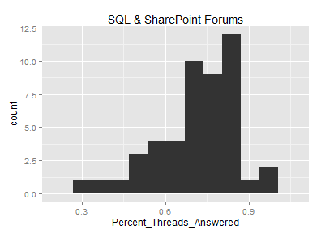 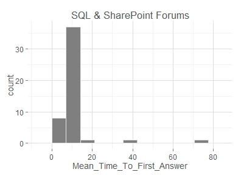 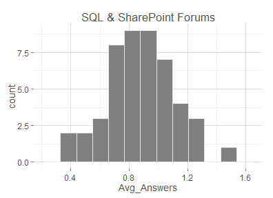 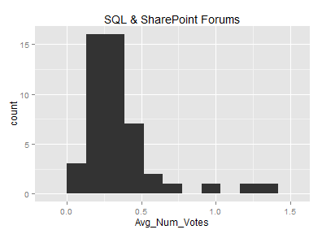 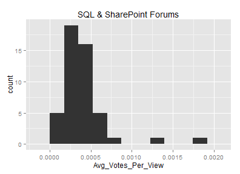 


The results look normal-ish, but the small sample size gives us only a rough picture. The Avg_Votes_Per_View graph is skewed by some outliers, so let's remove the outliers and replot.

```r
forums.sub <- subset(forums, Avg_Votes_Per_View < 0.001)
gg2 <- ggplot(data = forums.sub) + labs(y = "Number of Forums", 
  title = "SQL & SharePoint Forums")
print(gg2 + geom_histogram(aes(x = Avg_Votes_Per_View), binwidth = 0.0001))
```

 


What happens if we break these each into two graph -- once for each forum category?


```r
# create ggplot2 objects for each category
forums.sp <- subset(forums, Forum_Category == "SharePoint")
ggsp <- ggplot(data = forums.sp) + 
  labs(y="Number of Forums", title = "SharePoint Forums")
forums.sql <- subset(forums, Forum_Category == "SQL Server")
ggsql <- ggplot(data = forums.sql) +
  labs(y="Number of Forums", title = "SQL Forums")

# for each success metric
for (ind in 4:8){
  # plot a histogram for SQL server
  print(ggsql + geom_histogram(aes_string(x = colnames(forums)[ind]),
    binwidth = diff(range(forums.sql[,ind]))/nbins))
  # plot a histogram for SharePoint server
  print(ggsp + geom_histogram(aes_string(x = colnames(forums)[ind]),
    binwidth = diff(range(forums.sp[,ind]))/nbins))
}
```

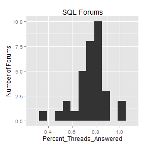 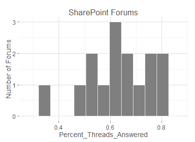 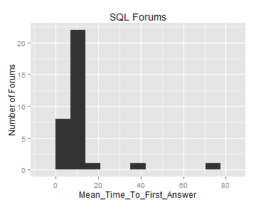 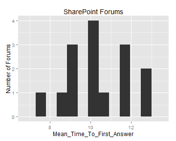 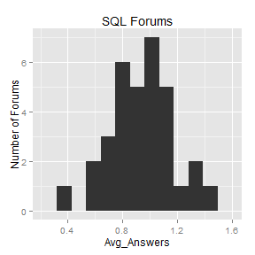 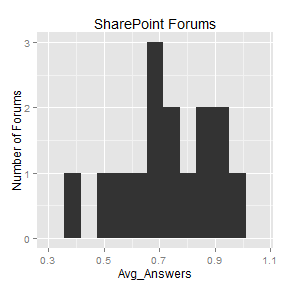 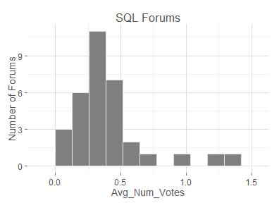 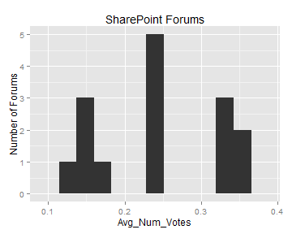 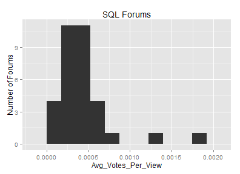 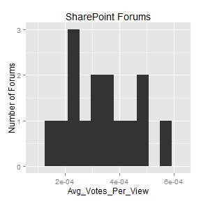 


### Correlation

Next, let's calculate the correlations between each of the metrics. Let's look at these for all 48 forums, plus for the SQL Server and SharePoint forums separately to see if we get more clear results.


```r
# load reshape so we can "melt"
library(reshape)

# create some stuff that I can reuse between plots
fill.grad <- scale_fill_gradient2(low="red", mid="white", high="green", midpoint=0, 
  space="rgb", guide="colourbar")
axis.theme <- theme(axis.text.y = element_text(size=10), 
  axis.text.x = element_text(size=10, angle=90))

# across all forums
cor.all <- cor(forums[,4:22])
ggplot(melt(cor.all), aes(X1, X2, fill=value)) + geom_tile() + 
  fill.grad + axis.theme + labs(y="", x="", title = "All Forums")  

# limit to SharePoint forums
cor.sp <- cor(forums.sp[,4:22])
ggplot(melt(cor.sp), aes(X1, X2, fill=value)) + geom_tile() + 
  fill.grad + axis.theme + labs(y="", x="", title = "SharePoint Forums")

# limit to SQL Server forums
cor.sql <- cor(forums.sql[,4:22])
ggplot(melt(cor.sql), aes(X1, X2, fill=value)) + geom_tile() + 
  fill.grad + axis.theme + labs(y="", x="", title = "SQL Forums")
```

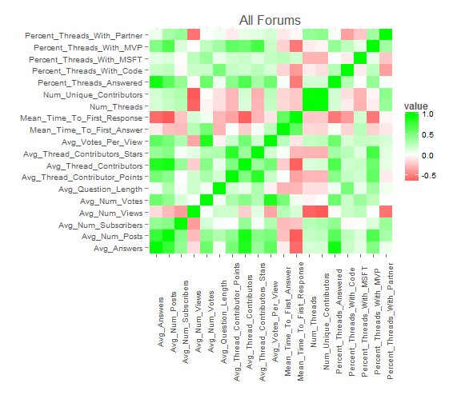 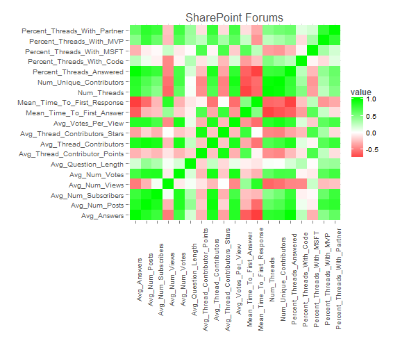 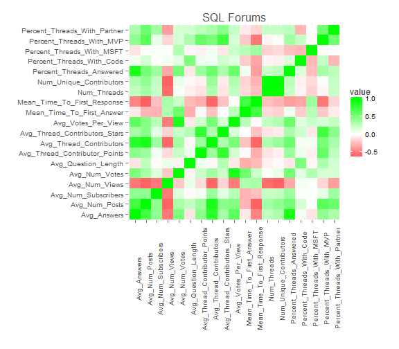 


To understand some of the highly correlated relationships better, let's take a look at some scatter plots, each with the success metric on the y-axis and the data points color-coded by forum category.


```r
# scatter plot of percent threads answered vs. average number of answers per thread
ggplot(forums, aes(y=Percent_Threads_Answered, x=Avg_Answers)) +
  geom_point(aes(color=Forum_Category)) +
  scale_colour_excel()

# scatter plot of percent threads answered vs. average number of conributors per thread
ggplot(forums, aes(y=Percent_Threads_Answered, x=Avg_Thread_Contributors)) +
  geom_point(aes(color=Forum_Category)) +
  scale_colour_excel()

# scatter plot of percent threads answered vs. average number of posts per thread
ggplot(forums, aes(y=Percent_Threads_Answered, x=Avg_Num_Posts)) +
  geom_point(aes(color=Forum_Category)) +
  scale_colour_excel()

# scatter plot of mean time to first answer vs. mean time to first response
ggplot(forums, aes(y=Mean_Time_To_First_Answer, x=Mean_Time_To_First_Response)) +
  geom_point(aes(color=Forum_Category)) +
  scale_colour_excel() + 
  coord_cartesian(ylim=c(0,20), xlim=c(0,12)) # ignore a couple far outliers

# scatter plot of mean time to first answer vs. number of unique contributors
ggplot(forums, aes(y=Mean_Time_To_First_Answer, x=Num_Unique_Contributors)) +
  geom_point(aes(color=Forum_Category)) +
  scale_colour_excel() +
  coord_cartesian(ylim=c(0,20)) # ignore a couple far outliers

# scatter plot of average number of answers per thread vs. average number of thread contributors
ggplot(forums, aes(y=Avg_Answers, x=Avg_Thread_Contributors)) +
  geom_point(aes(color=Forum_Category)) +
  scale_colour_excel()

# scatter plot of mean time to first answer vs. percent thread with MSFT involvement
ggplot(forums, aes(y=Mean_Time_To_First_Answer, x=Percent_Threads_With_MSFT)) +
  geom_point(aes(color=Forum_Category)) +
  scale_colour_excel() +
  coord_cartesian(ylim=c(0,20), xlim=c(0,0.20)) # ignore a couple far outliers

# scatter plot of mean time to first answer vs. percent thread with MVP involvement
ggplot(forums, aes(y=Mean_Time_To_First_Answer, x=Percent_Threads_With_MVP)) +
  geom_point(aes(color=Forum_Category)) +
  scale_colour_excel() +
  coord_cartesian(ylim=c(0,20), xlim=c(0,0.80)) # ignore a couple far outliers

# scatter plot of average number of votes per thread vs. percent thread with MSFT involvement
ggplot(forums, aes(y=Avg_Num_Votes, x=Percent_Threads_With_MSFT)) +
  geom_point(aes(color=Forum_Category)) +
  scale_colour_excel() +
  coord_cartesian(ylim=c(0,0.75), xlim=c(0,0.30)) # ignore a couple far outliers

# scatter plot of average number of votes per thread vs. average number of views per thread
ggplot(forums, aes(y=Avg_Num_Votes, x=Avg_Num_Views)) +
  geom_point(aes(color=Forum_Category)) +
  scale_colour_excel() +
  coord_cartesian(ylim=c(0,0.75), xlim=c(500,1500)) # ignore a couple far outliers

# scatter plot of number of threads vs. mean time to first answer
ggplot(forums, aes(y=Mean_Time_To_First_Answer, x=Num_Threads)) +
  geom_point(aes(color=Forum_Category)) +
  scale_colour_excel() +
  coord_cartesian(ylim=c(0,20)) # ignore a couple far outliers

# scatter plot of number of threads vs. mean time to first answer
ggplot(forums, aes(y=Mean_Time_To_First_Response, x=Num_Threads)) +
  geom_point(aes(color=Forum_Category)) +
  scale_colour_excel() +
  coord_cartesian(ylim=c(0,15)) # ignore a couple far outliers

# scatter plot of number of threads vs. mean time to first answer
ggplot(forums, aes(y=Mean_Time_To_First_Response, x=Avg_Question_Length)) +
  geom_point(aes(color=Forum_Category)) +
  scale_colour_excel() +
  coord_cartesian(ylim=c(0,15)) # ignore a couple far outliers

# scatter plot of number of threads vs. mean time to first answer
ggplot(forums, aes(y=Avg_Answers, x=Num_Threads)) +
  geom_point(aes(color=Forum_Category)) +
  scale_colour_excel()
```

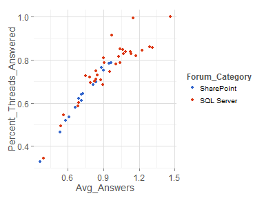 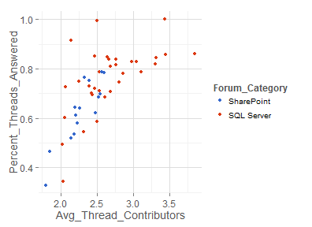 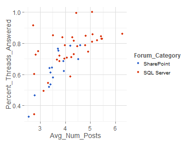 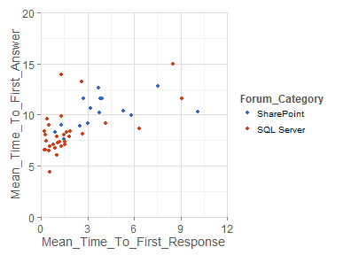 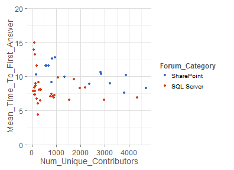 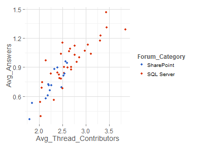 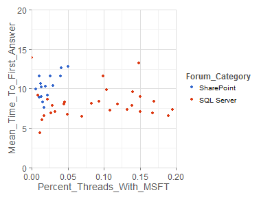 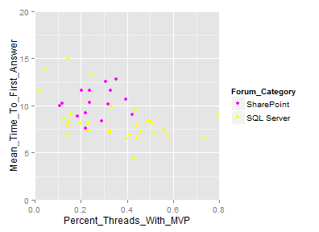  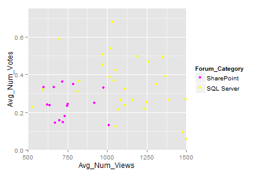 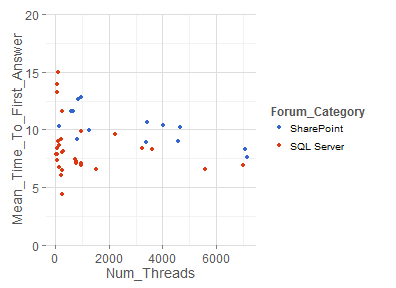 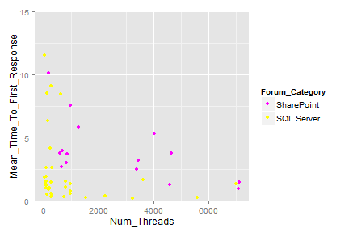 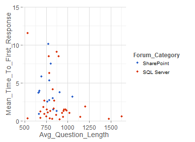  


TODO: ADD OBSERVATIONS BASED ON THE SCATTER PLOTS

Looking at Threads
---------------------------
Now that we got a high-level look at the forum level, let's drill down one level and look at threads. I'll start by loading the data from my database.


```r
# query the database and put results in a dataframe
threads <- sqlQuery(myDB, "SELECT * FROM Forums.dbo.Thread_Summary",
  stringsAsFactors=FALSE) 
# we can close the odbc connection now
odbcClose(myDB) 

# make sure data is loaded as expected
# we should have 72,324 threads
nrow(threads)
```

```
## [1] 72324
```

```r
# let's see the column names
colnames(threads)
```

```
##  [1] "Thread_ID"                "Title"                    "Question"                
##  [4] "Answered"                 "Num_Contributors"         "Asker_Type"              
##  [7] "Created_On"               "Answered_On"              "Answer_Has_Code"         
## [10] "Question_Has_Code"        "Forum_ID"                 "Forum_Name"              
## [13] "Forum_Category"           "Num_Answers"              "Time_To_First_Answer"    
## [16] "Num_Votes"                "Num_Votes_Per_View"       "Title_Length"            
## [19] "Question_Length"          "Num_Subscribers"          "Num_Views"               
## [22] "Time_To_First_Reply"      "Num_Posts"                "Num_Code_Posts"          
## [25] "Percent_Code_Posts"       "Num_MSFT_Contributors"    "Num_MSFT_Posts"          
## [28] "Num_MSFT_Answers"         "Num_MSFT_Code_Posts"      "Num_MSFT_Votes"          
## [31] "Num_MVP_Contributors"     "Num_MVP_Posts"            "Num_MVP_Answers"         
## [34] "Num_MVP_Code_Posts"       "Num_MVP_Votes"            "Num_Partner_Contributors"
## [37] "Num_Partner_Posts"        "Num_Partner_Answers"      "Num_Partner_Code_Posts"  
## [40] "Num_Partner_Votes"        "Avg_Contributor_Points"   "Avg_Contributor_Stars"   
## [43] "Created_Month"            "Created_Week_Day"         "Created_Hour"            
## [46] "Asker_Stars"              "Asker_Points"
```


The first 13 columns are identifiers and data types that will not work well doing math (i.e. dates and booleans). Columns 14-17 are our success metrics. The remianing columns are attributes which might give us some interesting insight into what affects the success metrics.

I will also append a few columns with engineered features that will make my life a little easier later on.


```r
# group title lengths into groups, with one group per 10 characters of length
threads$Title_Length_Group <- floor(threads$Title_Length/10) * 10 + 5

# group question lengths into groups, with one group per 40 characters of length
threads$Question_Length_Group <- floor(threads$Question_Length/40) * 40 + 20

# round time to first reply to the nearest day
threads$TTFR_Group <- floor(threads$Time_To_First_Reply + 0.5)
```


### Distributions

Let's see how the success metrics are distributed at the thread level.


```r
# create ggplot2 object
ggt <- ggplot(data = threads) + labs(title = "SQL & SharePoint Threads")

# Num_Answers histogram
ggt + geom_bar(aes(x = as.factor(Num_Answers)), binwidth=1) + coord_cartesian(xlim=c(0,8))

# Time_To_First_Answer histogram
ggt + geom_density(aes(x = Time_To_First_Answer), na.rm = TRUE) + coord_cartesian(xlim=c(0,30))

# Num_Votes histogram
ggt + geom_bar(aes(x = as.factor(Num_Votes)), binwidth=1) + coord_cartesian(xlim=c(0,10))

# Num_Votes_Per_View histogram
ggt + geom_density(aes(x = Num_Votes_Per_View), na.rm = TRUE) + coord_cartesian(xlim=c(0,0.005))
```

 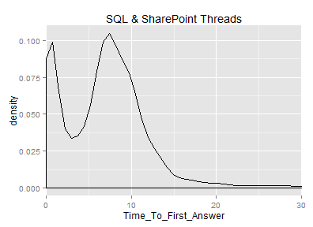 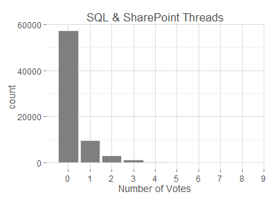 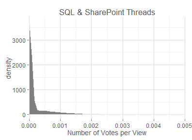 


That's an interesting double-peak in Time_To_First_Answer. Is that because we're mixing SQL and SharePoint? Let's take a look at each one separately. First SQL...


```r
# create ggplot2 object
ggt.sql <- ggplot(data = subset(threads, Forum_Category == "SQL Server")) + labs(title = "SQL Forums")

# Num_Answers histogram
ggt.sql + geom_bar(aes(x = as.factor(Num_Answers)), binwidth=1) + coord_cartesian(xlim=c(0,8))

# Time_To_First_Answer histogram
ggt.sql + geom_density(aes(x = Time_To_First_Answer), na.rm = TRUE) + coord_cartesian(xlim=c(0,30))

# Num_Votes histogram
ggt.sql + geom_bar(aes(x = as.factor(Num_Votes)), binwidth=1) + coord_cartesian(xlim=c(0,10))

# Num_Votes_Per_View histogram
ggt.sql + geom_density(aes(x = Num_Votes_Per_View), na.rm = TRUE) + coord_cartesian(xlim=c(0,0.005))
```

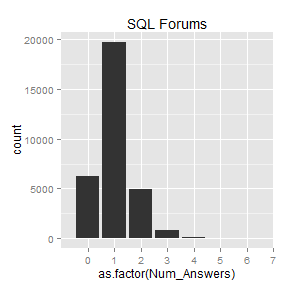 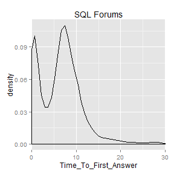 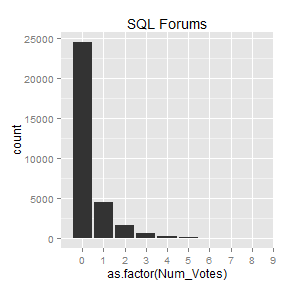 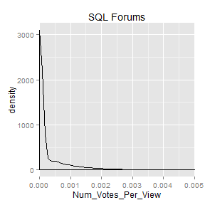 


Next let's look at SharePoint...


```r
# create ggplot2 object
ggt.sp <- ggplot(data = subset(threads, Forum_Category == "SharePoint")) + labs(title = "SharePoint Forums")

# Num_Answers histogram
ggt.sp + geom_bar(aes(x = as.factor(Num_Answers)), binwidth=1) + coord_cartesian(xlim=c(0,8))

# Time_To_First_Answer density plot
ggt.sp + geom_density(aes(x = Time_To_First_Answer), na.rm = TRUE) + coord_cartesian(xlim=c(0,30))

# Num_Votes histogram
ggt.sp + geom_bar(aes(x = as.factor(Num_Votes)), binwidth=1) + coord_cartesian(xlim=c(0,10))

# Num_Votes_Per_View histogram
ggt.sp + geom_density(aes(x = Num_Votes_Per_View), na.rm = TRUE) + coord_cartesian(xlim=c(0,0.005))
```

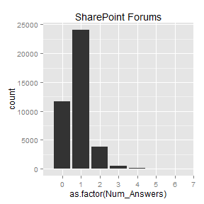 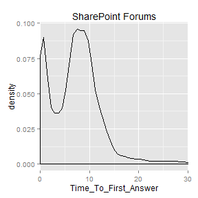 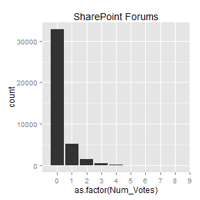 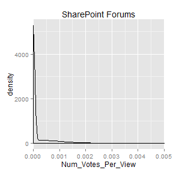 


That doesn't answer the double-peak question, but I do have a few quick observations:
* Noticably more questions go unanswered in SharePoint forums as compared to SQL forums.
* SQL forums users seem to be a little more generous with their voting.
* Both forums seems to have the highest Time_To_First_Answer frequency at about 7 days and the second highest frequency at about 1 day.

If the double-peak isn't caused by the different types of forums, could it be influenced by the weekend? Let's look at the days of the week individually and see if it becomes any clearer.


```r
for (day in 1:7)
{
  print(ggplot(data = subset(threads, Created_Week_Day == day)) + labs(title = paste("Day ", as.character(day))) + 
  geom_density(aes(x = Time_To_First_Answer), na.rm = TRUE) + coord_cartesian(xlim=c(0,6)))
}
```

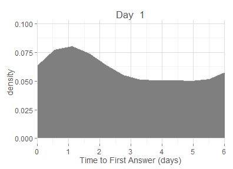 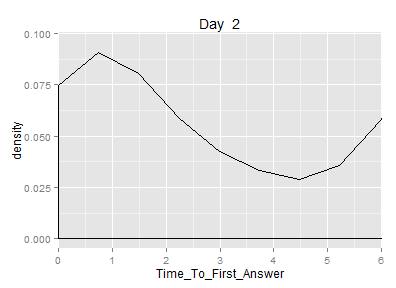 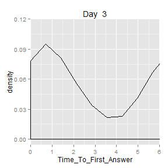 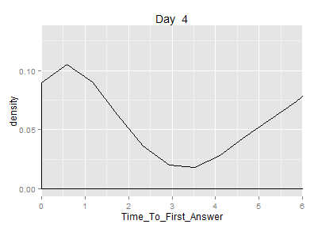 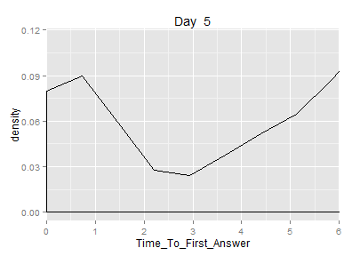 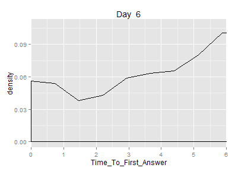 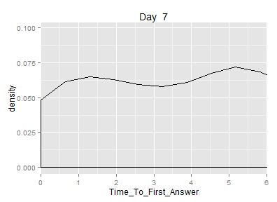 


Ah, yes. That's it. The days with the highest volume (Monday through Thursday) all have a significant trough when the weekend comes around (somewhere between 2 and 5 days), leading to a trough in the overall graph in that 2-5 day range.

Out of curiousity, I'd also like to see the distribution of the question/title length attributes and the time of the post attributes. These are things that are known immediately when a thread is posted, so they could be good inputs for a prediction model.


```r
# Title_Length density plot
ggt + geom_density(aes(x = Title_Length)) + coord_cartesian(xlim=c(0,250))

# Question_Length density plot
ggt + geom_density(aes(x = Question_Length)) + coord_cartesian(xlim=c(0,5000))

# Created_Week_Day bar chart
ggt + geom_bar(aes(x = as.factor(Created_Week_Day)), binwidth=1)

# Created_Month bar chart 
ggt + geom_bar(aes(x = as.factor(Created_Month)), binwidth=1)

# Created_Hour bar chart
ggt + geom_bar(aes(x = as.factor(Created_Hour)), binwidth=1)
```

 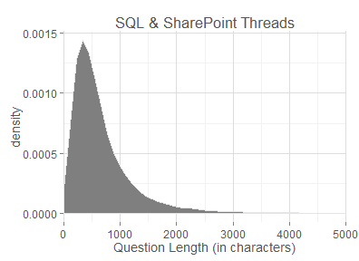 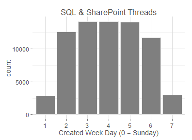   


And, let's see the distributions of threads based on the number of posts made by Microsft, MVPs, and partners.


```r
# MSFT histogram
ggt + geom_bar(aes(x = as.factor(Num_MSFT_Posts)), binwidth=1)

# MSFT histogram without zero
ggt + geom_bar(aes(x = as.factor(Num_MSFT_Posts)), binwidth=1) + coord_cartesian(xlim=c(1.5,10), ylim=c(0,3000))

# MVP histogram
ggt + geom_bar(aes(x = as.factor(Num_MVP_Posts)), binwidth=1) + coord_cartesian(xlim=c(0,11.5))

# MVP histogram without zero
ggt + geom_bar(aes(x = as.factor(Num_MVP_Posts)), binwidth=1) + coord_cartesian(xlim=c(1.5,11.5), ylim=c(0,15000))

# Partner histogram
ggt + geom_bar(aes(x = as.factor(Num_Partner_Posts)), binwidth=1) + coord_cartesian(xlim=c(0,11.5))

# Partner histogram without zero
ggt + geom_bar(aes(x = as.factor(Num_Partner_Posts)), binwidth=1) + coord_cartesian(xlim=c(1.5,11.5), ylim=c(0,25000))
```

      


Almost there... Here are the distributions of a few remaining, potentially interesting attributes.


```r
# asker points
ggt + geom_density(aes(x = Asker_Points)) + coord_cartesian(xlim=c(0,2000))

# subscribers
ggt + geom_bar(aes(x = as.factor(Num_Subscribers)), binwidth=1) + coord_cartesian(xlim=c(0,8.5))

# views
ggt + geom_density(aes(x = Num_Views)) + coord_cartesian(xlim=c(0,4000))

# TTFR
ggt + geom_density(aes(x = Time_To_First_Reply), na.rm = TRUE) + coord_cartesian(xlim=c(0,10))
```

    


Finally, I wonder when it is that Microsoft decides to get involved in threads. I'm going to plot some distributions for those threads that Microsoft got involved on and see if they have any distinct differences from the overall distributions.


```r

# create ggplot2 object for only MSFT-involved threads
ggt.msft <- ggplot(data = subset(threads, Num_MSFT_Posts > 0)) + labs(title = "Threads with MSFT Engagement")

# Num_Answers histogram
ggt.msft + geom_bar(aes(x = as.factor(Num_Answers)), binwidth=1) + coord_cartesian(xlim=c(0,8))

# Time_To_First_Answer histogram
ggt.msft + geom_density(aes(x = Time_To_First_Answer), na.rm = TRUE) + coord_cartesian(xlim=c(0,30))

# Num_Votes histogram
ggt.msft + geom_bar(aes(x = as.factor(Num_Votes)), binwidth=1) + coord_cartesian(xlim=c(0,10))

# Title_Length density plot
ggt.msft + geom_density(aes(x = Title_Length)) + coord_cartesian(xlim=c(0,250))

# Question_Length density plot
ggt.msft + geom_density(aes(x = Question_Length)) + coord_cartesian(xlim=c(0,5000))

# Created_Week_Day bar chart
ggt.msft + geom_bar(aes(x = as.factor(Created_Week_Day)), binwidth=1)

# Created_Month bar chart 
ggt.msft + geom_bar(aes(x = as.factor(Created_Month)), binwidth=1)

# Created_Hour bar chart
ggt + geom_bar(aes(x = as.factor(Created_Hour)), binwidth=1)

# Num_Votes_Per_View histogram
ggt.msft + geom_density(aes(x = Num_Votes_Per_View), na.rm = TRUE) + coord_cartesian(xlim=c(0,0.005))

# asker points
ggt.msft + geom_density(aes(x = Asker_Points)) + coord_cartesian(xlim=c(0,2000))

# subscribers
ggt.msft + geom_bar(aes(x = as.factor(Num_Subscribers)), binwidth=1) + coord_cartesian(xlim=c(0,8.5))

# views
ggt.msft + geom_density(aes(x = Num_Views)) + coord_cartesian(xlim=c(0,4000))

# TTFR
ggt.msft + geom_density(aes(x = Time_To_First_Reply), na.rm = TRUE) + coord_cartesian(xlim=c(0,10))
```

             

### Correlations


```r
# across all threads
cor.all <- cor(threads[,14:47], use="pairwise.complete.obs")
ggplot(melt(cor.all), aes(X1, X2, fill=value)) + geom_tile() + 
  fill.grad + axis.theme + labs(y="", x="", title = "All Threads")  
```

 


This is useless. On to something else...

### Responsiveness

Is there some relationship between the length of the title/question and time to first answer/response?


```r
# scatter plot of TTFR vs. the title's length

ggt + aes(y=Time_To_First_Reply, x=Title_Length_Group) +
  coord_cartesian(xlim=c(0,125), ylim=c(0,4)) +
  stat_summary(fun.y = 'mean', fun.ymin = mean, fun.ymax = mean)

# scatter plot of TTFA vs. the title's length
ggt + aes(y=Time_To_First_Answer, x=Title_Length_Group) +
  coord_cartesian(xlim=c(0,125), ylim=c(0,15)) +
  stat_summary(fun.y = 'mean', fun.ymin = mean, fun.ymax = mean)

# scatter plot of TTFR vs. the question's length
ggt + aes(y=Time_To_First_Reply, x=Question_Length_Group) +
  coord_cartesian(xlim=c(0,2000), ylim=c(0,4)) +
  stat_summary(fun.y = 'mean', fun.ymin = mean, fun.ymax = mean)

# scatter plot of TTFA vs. the question's length
ggt + aes(y=Time_To_First_Answer, x=Question_Length_Group) +
  coord_cartesian(xlim=c(0,2000), ylim=c(0,15)) +
  stat_summary(fun.y = 'mean', fun.ymin = mean, fun.ymax = mean)
```

    


Does the time the post was made affect it's ability to get answered?


```r

# scatter plot of TTFR vs. the hour
ggt + aes(y=Time_To_First_Reply, x=as.factor(Created_Hour)) +
  coord_cartesian(xlim=c(0,25), ylim=c(0,3)) +
  stat_summary(fun.y = 'mean', fun.ymin = mean, fun.ymax = mean)

# scatter plot of TTFA vs. the hour
ggt + aes(y=Time_To_First_Answer, x=as.factor(Created_Hour)) +
  coord_cartesian(xlim=c(0,25), ylim=c(0,15)) +
  stat_summary(fun.y = 'mean', fun.ymin = mean, fun.ymax = mean)

# scatter plot of TTFR vs. the day
ggt + aes(y=Time_To_First_Reply, x=as.factor(Created_Week_Day)) +
  coord_cartesian(xlim=c(0,8), ylim=c(0,3)) +
  stat_summary(fun.y = 'mean', fun.ymin = mean, fun.ymax = mean)

# scatter plot of TTFA vs. the day
ggt + aes(y=Time_To_First_Answer, x=as.factor(Created_Week_Day)) +
  coord_cartesian(xlim=c(0,8), ylim=c(0,15)) +
  stat_summary(fun.y = 'mean', fun.ymin = mean, fun.ymax = mean)

# scatter plot of TTFR vs. the month
ggt + aes(y=Time_To_First_Reply, x=as.factor(Created_Month)) +
  coord_cartesian(xlim=c(0,13), ylim=c(0,3)) +
  stat_summary(fun.y = 'mean', fun.ymin = mean, fun.ymax = mean)

# scatter plot of TTFA vs. the month
ggt + aes(y=Time_To_First_Answer, x=as.factor(Created_Month)) +
  coord_cartesian(xlim=c(0,13), ylim=c(0,15)) +
  stat_summary(fun.y = 'mean', fun.ymin = mean, fun.ymax = mean)
```

      


We are finally getting some interesting results. The length of the question and title and the time of thread creation are things that we know immediately when a thread is created. And, we observe some patterns between these things and the length of time before a thread is responded to and answered. Perhaps there is room for some prediction here.

We see an improvement in time to first answer as the year progresses. Is this seasonal or a result of improvement in the forums (perhaps a higher focus internally from Microsoft or its partners)?


```r

# MSFTs

msft.ply <- ddply(threads, "Created_Month", summarise, Total_MSFT_Posts = sum(Num_MSFT_Posts), Total_Posts = sum(Num_Posts))

gg.msft <- ggplot(msft.ply, aes(x = factor(Created_Month))) + labs(title="SQL & SharePoint Threads", x="Thread Created Month") + geom_bar(stat = "identity")

gg.msft + aes(y = Total_MSFT_Posts) + labs(y="Number of MSFT Posts") 
gg.msft + aes(y = Total_MSFT_Posts/Total_Posts) + labs(y="MSFT Posts as Percent of Total Posts")

# MVPs

mvp.ply <- ddply(threads, "Created_Month", summarise, Total_MVP_Posts = sum(Num_MVP_Posts), Total_Posts = sum(Num_Posts))

gg.mvp <- ggplot(mvp.ply, aes(x = factor(Created_Month))) + labs(title="SQL & SharePoint Threads", x="Thread Created Month") + geom_bar(stat = "identity")

gg.mvp + aes(y = Total_MVP_Posts) + labs(y="Number of MVP Posts")
gg.mvp + aes(y = Total_MVP_Posts/Total_Posts) + labs(y="MVP Posts as Percent of Total Posts")

# Partners

part.ply <- ddply(threads, "Created_Month", summarise, Total_Partner_Posts = sum(Num_Partner_Posts), Total_Posts = sum(Num_Posts))

gg.part <- ggplot(part.ply, aes(x = factor(Created_Month))) + labs(title="SQL & SharePoint Threads", x="Thread Created Month") + geom_bar(stat = "identity")

gg.part + aes(y = Total_Partner_Posts) + labs(y="Number of Partner Posts")
gg.part + aes(y = Total_Partner_Posts/Total_Posts) + labs(y="Partner Posts as Percent of Total Posts")
```

      


It looks like MSFT employees took a break (just like everyone else) at the end of the year. There was an uptick in the relative level of MVP and partner activity, but I'm doubtful this made any significant difference. However, I did find it surprising to see the level of partner activity is greater than 25%. 

To look at the seasonality aspect, we could scrape another year of data from the website, but I'll leave that for a follow up analysis...

### Success Rate

The ultimate question of a thread's success is really whether or not it ever got answered. Of course we'd like to see it happen as fast as possible, but the more important thing is to see whether it was resolved at all. Let's look at the "success rate" (the ratio of threads that received an answer to the total number of threads created) in a few different slices.

TODO: success rate by question/title length

```r
# By month
succ.ply <- ddply(threads, "Created_Month", summarise, Total_Questions = length(Num_Answers), Successes = sum(Answered))
ggplot(succ.ply, aes(x = factor(Created_Month), y = Successes/Total_Questions)) + labs(title="SQL & SharePoint Threads", x="Thread Created Month", y="Success Rate") + geom_point()

# By week day
succ.ply <- ddply(threads, "Created_Week_Day", summarise, Total_Questions = length(Num_Answers), Successes = sum(Answered))
ggplot(succ.ply, aes(x = factor(Created_Week_Day), y = Successes/Total_Questions)) + labs(title="SQL & SharePoint Threads", x="Thread Created Week Day", y="Success Rate") + geom_point()

# By time of day
succ.ply <- ddply(threads, "Created_Hour", summarise, Total_Questions = length(Num_Answers), Successes = sum(Answered))
ggplot(succ.ply, aes(x = factor(Created_Hour), y = Successes/Total_Questions)) + labs(title="SQL & SharePoint Threads", x="Thread Created Hour", y="Success Rate") + geom_point()

# By title length
succ.ply <- ddply(threads, "Title_Length_Group", summarise, Total_Questions = length(Num_Answers), Successes = sum(Answered))
ggplot(succ.ply, aes(x = Title_Length_Group, y = Successes/Total_Questions)) + labs(title="SQL & SharePoint Threads", y="Success Rate") + geom_point() + coord_cartesian(xlim=c(0,130), ylim=c(0.5, 1))

# By question length
succ.ply <- ddply(threads, "Question_Length_Group", summarise, Total_Questions = length(Num_Answers), Successes = sum(Answered))
ggplot(succ.ply, aes(x = Question_Length_Group, y = Successes/Total_Questions)) + labs(title="SQL & SharePoint Threads", y="Success Rate") + geom_point() + coord_cartesian(xlim=c(0,2100), ylim=c(0.5, 1))

# By TTFR
succ.ply <- ddply(threads, "TTFR_Group", summarise, Total_Questions = length(Num_Answers), Successes = sum(Answered))
ggplot(succ.ply, aes(x = TTFR_Group, y = Successes/Total_Questions)) + labs(title="SQL & SharePoint Threads", y="Success Rate") + geom_point() + coord_cartesian(xlim=c(-0.5,20.5), ylim=c(0, 1))

# By MSFT posts (bar chart)
succ.ply <- ddply(threads, "Num_MSFT_Posts", summarise, Total_Questions = length(Num_Answers), Successes = sum(Answered))
ggplot(succ.ply, aes(x = factor(Num_MSFT_Posts), y = Successes/Total_Questions)) + labs(title="SQL & SharePoint Threads", y="Success Rate") + geom_point() + coord_cartesian(xlim=c(0.5,5.5), ylim=c(0, 1))
```

       


### SharePoint 2010 - Development and Programming

The forum in the scope of my scraping with the most threads in 2013 was "SharePoint 2010 - Development and Programming." Let's make some scatter plots just focusing on this forum.


```r
# get the threads that are part of this largest forum
big.forum = subset(threads, Forum_ID=="20bb4834-3140-42bb-a262-a6f1267f7fd7")
```


I'm wondering what impact the asker has on the successfulness of the thread. The data contains the number of points of the asker, so let's scatter than against each of the success factors. Let's use the color to encode the number of stars the asker has.


```r
# get set up
gg.bf <- ggplot(data = big.forum) + labs(title = "SharePoint 2010 - Development and Programming") + scale_colour_excel()

# scatter plot of number of answers vs. the points of the asker
gg.bf + aes(y=jitter(Num_Answers), x=Asker_Points) + geom_point(aes(color=Asker_Type)) 

# scatter plot of TTFA vs. the points of the asker
gg.bf + aes(y=Time_To_First_Answer, x=Asker_Points) + geom_point(aes(color=Asker_Type)) 

# scatter plot of TTFA vs. the points of the asker - zoomed in
gg.bf + aes(y=Time_To_First_Answer, x=Asker_Points) +
  geom_point(aes(color=Asker_Type)) + coord_cartesian(xlim=c(0,1000), ylim=c(0,50))

# scatter plot of num votes vs. the points of the asker
gg.bf + aes(y=jitter(Num_Votes), x=Asker_Points) + geom_point(aes(color=Asker_Type))

# scatter plot of num votes per view vs. the points of the asker
gg.bf + aes(y=Num_Votes_Per_View, x=Asker_Points) + geom_point(aes(color=Asker_Type))
```

     


These do no prove to be insightful. Too many points. 

How does profile of issues where MSFT or MVP was involved differ from other threads?

TODO: BUILD LINEAR MODEL OF TIME TO FIRST RESPONSE BASED ON FORUM, DATETIME, QUESTION LENGTH, TITLE LENGTH, REPUTATION OF ASKER

get number of MSFT and MVP contributors on each forum. get their relative percentage of posts

Possibilities for Future Exploration
---------------------------------------
Forums are subject to social dynamics. That is, the personalities, habits, and relationships of a forum's participants play important roles in the successfulness of the forum. In future analysis, it would be interesting to dig into these relationships and ask questions like: are users more likely to answer a question if the asker helped them in the past? Does getting answers generally drive participants to 'pass it on' and give someone else an answer? Are there certain individuals who can single-handedly have a significant impact on a forum's dynamics?

Being that we see significant differences between SQL Server forums and SharePoint forums, it would be insightful to better understand what's being done differently in these spaces. Talking to experts on these forums might be helpful. Also, adding other forum categories to the analysis to see how they compare would add more color. Perhaps every forum category has it's own unqiue profile, or perhaps most forums are like SQL Server forums and SharePoint forums are outlier (or vice versa).
